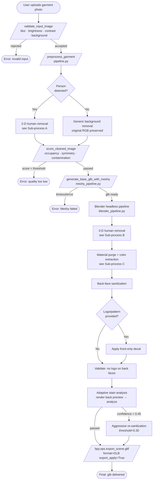
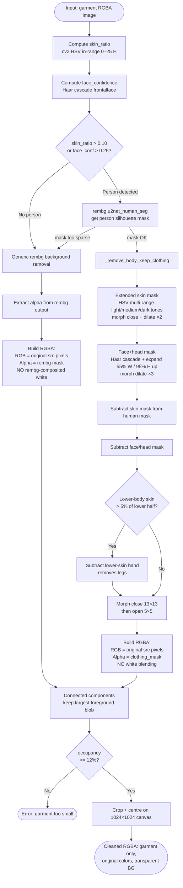
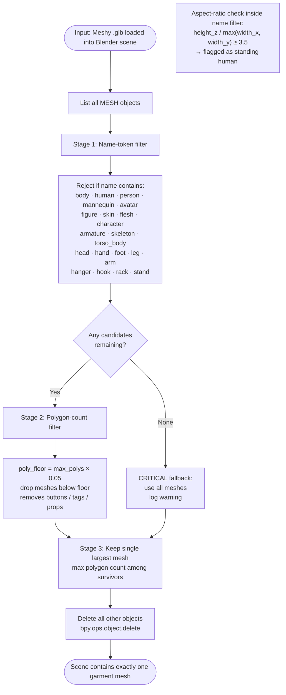
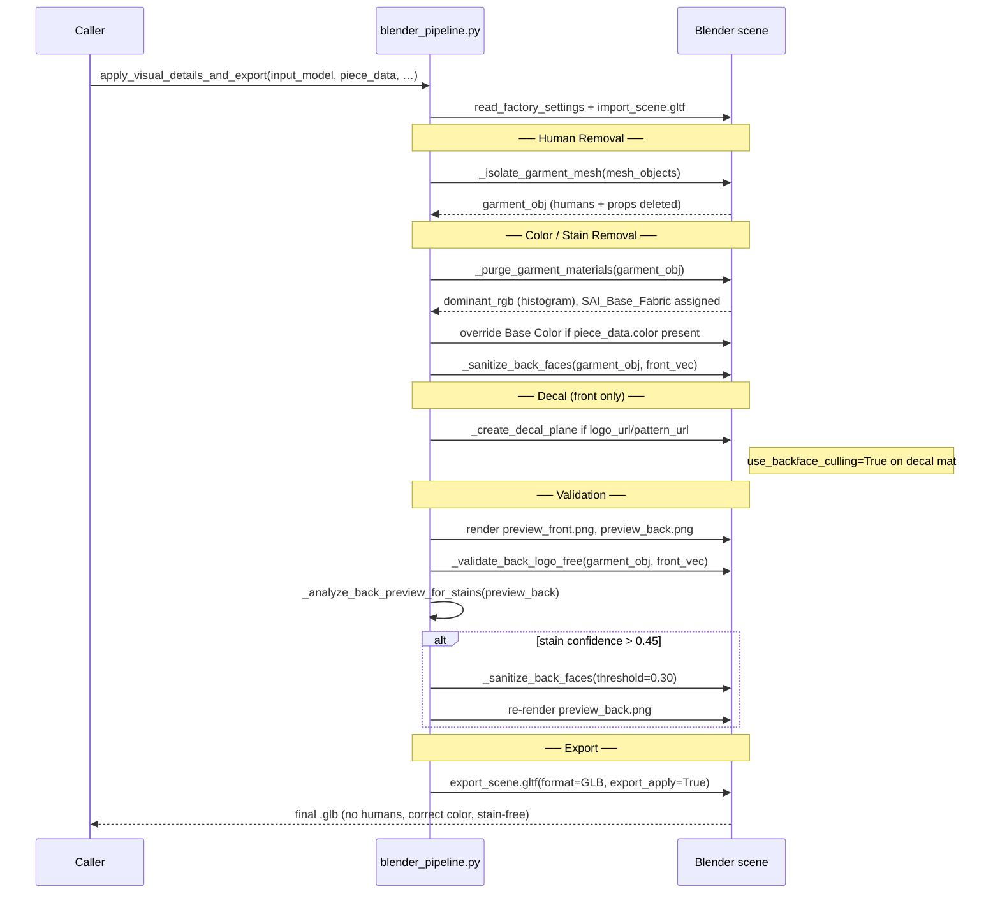

# Blender Pipeline — Cloth Coloring & Human Removal (BPMN)

This document describes, through BPMN-style flowcharts and code snippets, how
the StylistAI Blender pipeline guarantees:

1. **Cloth pieces are correctly colored** — no white stains from photo backgrounds,
   Meshy texture wrapping, or rembg alpha-compositing survive into the final `.glb`.
2. **Human bodies are absent** from the final `.glb` — both at the image
   pre-processing stage (2-D) and at the Blender mesh stage (3-D).

---

## 1. Main Pipeline Process



---

## 2. Sub-process A — 2-D Human Removal (Image Stage)

**File:** `blender-worker/pipeline.py` · `preprocess_garment()`



**Key invariant — no white staining at image stage:**

```python
# pipeline.py  _remove_body_keep_clothing()
result = np.zeros((src_np.shape[0], src_np.shape[1], 4), dtype=np.uint8)
result[:, :, :3] = rgb          # ← original pixel colors, never composited
result[:, :, 3]  = clothing_mask
```

```python
# pipeline.py  preprocess_garment() — no-person branch
rgba[:, :, :3] = src_np[:, :, :3]   # ← original colors preserved
rgba[:, :, 3]  = generic_mask        # ← rembg mask only, not rembg RGBA
```

---

## 3. Sub-process B — 3-D Human Removal (Blender Stage)

**File:** `blender-worker/blender_pipeline.py` · `_isolate_garment_mesh()`  
Also: `blender-worker/blender-scripts/refine_glb.py` · `_filter_garment_only()`



**Code snippet:**

```python
# blender_pipeline.py  _is_human_like()
def _is_human_like(obj) -> bool:
    name_lower = (obj.name + " " + obj.data.name).lower()
    for token in _HUMAN_NAME_TOKENS:          # frozenset of body keywords
        if token in name_lower:
            return True
    bbox  = [obj.matrix_world @ v for v in obj.bound_box]
    xs    = [v.x for v in bbox]; ys = [v.y for v in bbox]; zs = [v.z for v in bbox]
    width = max(max(xs)-min(xs), max(ys)-min(ys), 1e-6)
    aspect = (max(zs)-min(zs)) / width
    return aspect >= 3.5   # standing-human shape threshold
```

---

## 4. Sub-process C — Cloth Coloring & Stain Removal (Blender Stage)

**File:** `blender-worker/blender_pipeline.py`  
Functions: `_purge_garment_materials()`, `_extract_dominant_color()`, `_sanitize_back_faces()`, `_analyze_back_preview_for_stains()`

```mermaid
flowchart TD
    C0([Input: single garment mesh after human removal]) --> C1

    C1[_extract_dominant_color\nbefore clearing materials]
    C1 --> C1a[Sample central 60% of texture\nup to 2 048 pixels via stride]
    C1a --> C1b["Quantise to 16³ color bins\n(16 buckets per RGB channel)"]
    C1b --> C1c[Find most-populated bin\nweighted centroid = dominant_rgb]
    C1c --> C1d{Valid texture\nfound?}
    C1d -->|No| C1e[Fallback: read BSDF Base Color\ndefault_value]
    C1d -->|Yes| C2
    C1e --> C2

    C2[_purge_garment_materials\nclear ALL material slots]
    C2 --> C2a[Create SAI_Base_Fabric\nPrincipled BSDF\nBase Color = dominant_rgb\nRoughness = 0.80  Specular = 0.03]
    C2a --> C2b{piece_data\ncolor_hex provided?}
    C2b -->|Yes| C2c[Override SAI_Base_Fabric\nBase Color with user hex\ndominant_rgb = user_rgb]
    C2b -->|No| C3
    C2c --> C3

    C3[_sanitize_back_faces\ndot_threshold = 0.15]
    C3 --> C3a[Re-derive back color\n_extract_dominant_color on SAI_Base_Fabric\nnow returns user/dominant color]
    C3a --> C3b[Create SAI_Back_Plain\nPrincipled BSDF + noise texture\nScale=120 Detail=6 Fac=0.06]
    C3b --> C3c["Assign SAI_Back_Plain to all faces\nwhere dot(normal, front_dir) < 0.15"]

    C3c --> C4[Render back preview\n768×768 PNG]
    C4 --> C5[_analyze_back_preview_for_stains]
    C5 --> C5a[Load PNG pixels as float32 array]
    C5a --> C5b["Garment mask: lum ∈ (0.08, 0.93) and alpha > 0.15"]
    C5b --> C5c[Compute per-pixel median color\nrobust to stain outliers]
    C5c --> C5d[RGB distance from median per pixel]
    C5d --> C5e["hotspot_ratio = mean(dist > 0.20)\nartifact_confidence = min(1.0,\n  hotspot_ratio×3.5 + max(0,variance−0.08)×2.5)"]

    C5e --> C6{confidence\n> 0.45?}
    C6 -->|Yes, stain detected| C7[_sanitize_back_faces\naggressive dot_threshold = 0.30]
    C6 -->|No, clean| C8
    C7 --> C8

    C8[Validate no logo on back faces\n_validate_back_logo_free]
    C8 -->|logo found on back| C9[Force aggressive re-sanitization]
    C8 -->|back logo-free| End4
    C9 --> End4([Garment: correct color, stain-free, human-free])
```



**Key code — histogram-mode dominant color (stain-resistant):**

```python
# blender_pipeline.py  _extract_dominant_color()
buckets: dict[tuple[int,int,int], list] = {}
for row in range(y0, y1, step):
    for col in range(x0, x1, step):
        r, g, b = pixels[base], pixels[base+1], pixels[base+2]
        key = (
            min(15, int(r * 16)),   # 16 bins per channel
            min(15, int(g * 16)),
            min(15, int(b * 16)),
        )
        buckets.setdefault(key, [0, 0.0, 0.0, 0.0])
        buckets[key][0] += 1
        buckets[key][1] += r; buckets[key][2] += g; buckets[key][3] += b

best  = max(buckets.values(), key=lambda v: v[0])
n     = best[0]
dominant = (best[1]/n, best[2]/n, best[3]/n)   # stain-proof fabric color
```

**Key code — back sanitization (clean plain fabric on back faces):**

```python
# blender_pipeline.py  _sanitize_back_faces()
for face in bm.faces:
    if face.normal.dot(local_front) < dot_threshold:   # default 0.15
        face.material_index = back_idx   # → SAI_Back_Plain (fabric weave noise)
```

---

## 5. Integration: apply_visual_details_and_export()

This is the programmatic entry point that chains all sub-processes in order.



---

## 6. Guarantee Summary

| Guarantee | Mechanism | File / Function |
|-----------|-----------|----------------|
| No human body in 2-D input to Meshy | HSV skin mask + Haar face detection + rembg human seg | `pipeline.py` · `_remove_body_keep_clothing` |
| No white staining from rembg compositing | RGB copied from original; only alpha mask from rembg | `pipeline.py` · `preprocess_garment` |
| No human mesh in Blender scene | Name-token filter + aspect-ratio filter + poly-floor filter | `blender_pipeline.py` · `_isolate_garment_mesh` |
| No Meshy photo-baked stains on any face | All materials purged; dominant color via histogram-mode | `blender_pipeline.py` · `_purge_garment_materials` |
| No front-photo texture on back of garment | Back faces get procedural SAI_Back_Plain material | `blender_pipeline.py` · `_sanitize_back_faces` |
| Persistent stains removed after rendering | Stain analysis on rendered preview triggers re-sanitization | `blender_pipeline.py` · `_analyze_back_preview_for_stains` |
| Logo appears only on front faces | Decal material has `use_backface_culling=True`; face selection by dot-product filter | `blender_pipeline.py` · `_create_decal_material` / `_apply_decal_to_front_faces` |
| Post-decal back-logo validation | Explicit walk of all back-facing polygons; aggressive re-sanitization if any non-fabric material found | `blender_pipeline.py` · `_validate_back_logo_free` |
| Human meshes also removed at refine step | Same name-token + aspect-ratio logic in Blender script | `blender-scripts/refine_glb.py` · `_filter_garment_only` |

---

## 7. Threshold Reference

| Constant | Value | Meaning |
|----------|-------|---------|
| `FRONT_FACE_DOT_THRESHOLD` | 0.35 | Min dot(normal, front_axis) for decal application (~70° from front) |
| `BACK_SANITIZE_DOT_THRESHOLD` | 0.15 | Default: faces with dot < 0.15 get SAI_Back_Plain |
| `BACK_SANITIZE_AGGRESSIVE_THRESHOLD` | 0.30 | Used when stain/logo detected after initial sanitization |
| `STAIN_ARTIFACT_RETRIGGER_CONFIDENCE` | 0.45 | Composite stain score that triggers re-sanitization |
| `FRONT_STAIN_CHECK_CONFIDENCE` | 0.35 | Front preview stain warning threshold (no corrective action) |
| `_COLOR_HIST_BUCKETS` | 16 | Bins per RGB channel for histogram-mode color extraction (16³ = 4 096 bins) |
| `_HUMAN_ASPECT_RATIO` | 3.5 | Height/width ratio above which a mesh is flagged as human-shaped |
| `_MIN_POLY_FRACTION` | 0.05 | Meshes with < 5% of largest mesh's polygons are treated as props |
