# RELAÇÃO DE ARTEFATOS — ESPECIFICAÇÃO DO PROJETO
## FAI Social Network

**Matheus Braschi Haliski · Bryan Strey · Victor Luis Soares Brito · Stephanny Almeida**

> Trabalho apresentado como requisito parcial para a disciplina de Desenvolvimento Ágil de Produto I, do curso de Bacharelado em Sistemas de Informação, da PUCPR.
>
> **Orientadores:**
> Profa. Cristina Verçosa P. B. de Souza · Prof. Evandro Alberto Zatti · Prof. Geucimar Briatore · Profa. Joselaine Valaski

**Curitiba — 2026**

---

## SUMÁRIO

1. [Quadro "3 Objetivos"](#1-quadro-3-objetivos)
2. [Quadro "É – Não É – Faz – Não Faz"](#2-quadro-é--não-é--faz--não-faz)
3. [Visão do Produto](#3-visão-do-produto)
4. [Relação de Atores / Usuários](#4-relação-de-atores--usuários)
5. [Relação de Requisitos Funcionais](#5-relação-de-requisitos-funcionais)
6. [Relação de Histórias de Usuário](#6-relação-de-histórias-de-usuário)
7. [Modelo de Dados](#7-modelo-de-dados)
8. [Diagramas UML](#8-diagramas-uml)
   - 8.1 Diagrama de Casos de Uso
   - 8.2 Diagrama de Classes
   - 8.3 Diagrama Entidade-Relacionamento
   - 8.4 Diagramas de Atividades
   - 8.5 Diagramas de Sequência
9. [Analytics](#9-analytics)

---

## 1. QUADRO "3 OBJETIVOS"

| **NOME DO PRODUTO** | **FAI Social Network** |
|---|---|

| # | OBJETIVO | DESCRIÇÃO |
|---|---|---|
| 1 | **Interação Social com Conteúdo de Moda** | Permitir que os usuários autenticados na plataforma FAI interajam com esquemas de moda e peças de roupa publicados por outros membros da comunidade, por meio das funcionalidades de curtir, comentar, remixar e compartilhar publicações, promovendo engajamento contínuo dentro do ecossistema da plataforma. |
| 2 | **Comunidade e Descoberta de Moda** | Disponibilizar um feed comunitário público onde os usuários possam explorar, buscar e se inspirar com esquemas de vestimenta criados pela comunidade, com suporte a filtros por estilo, ocasião e tendência, além de possibilitar o salvamento e favoritar de publicações de outros usuários. |
| 3 | **Visibilidade de Marcas (Maison) e Exportação Social** | Oferecer uma aba dedicada ao perfil de marcas de moda cadastradas na plataforma (Maison), conectando varejistas com usuários e digital influencers, além de permitir a exportação e compartilhamento de outfit cards e do DNA de Estilo em redes sociais externas, amplificando o alcance da identidade visual de cada usuário. |

---

## 2. QUADRO "É – NÃO É – FAZ – NÃO FAZ"

| **NOME DO PRODUTO** | **FAI Social Network** |
|---|---|

| **É** | **Não É** |
|---|---|
| Uma rede social integrada ao ecossistema Fashion AI, focada exclusivamente em moda e estilo pessoal. | Uma rede social generalista (como Instagram, TikTok ou X/Twitter) com feed de conteúdo aberto. |
| Uma comunidade digital para publicação, descoberta e engajamento com esquemas de moda e peças de roupa. | Um marketplace ou plataforma de e-commerce com transações diretas entre usuários. |
| Um canal de visibilidade para marcas de moda (Maison) dentro da plataforma FAI. | Um serviço de mensagens diretas ou chat entre usuários. |
| Um ambiente de exportação de identidade visual (outfit cards, DNA de Estilo) para redes sociais externas. | Um substituto das redes sociais externas — é um complemento integrado. |

| **Faz** | **Não Faz** |
|---|---|
| Publica esquemas de moda no feed comunitário, com controle de visibilidade (público/privado). | Intermediar transações comerciais ou pagamentos entre usuários e marcas. |
| Permite curtir, comentar, remixar e compartilhar publicações de outros membros. | Gerar conteúdo de texto livre sem vínculo a um esquema de moda ou peça de roupa. |
| Exibe feed comunitário com publicações filtradas por estilo, ocasião e tendência. | Realizar moderação automática de conteúdo textual (comentários são curados manualmente). |
| Permite visualizar perfis públicos de usuários e acompanhar sua produção de moda. | Gerenciar campanhas publicitárias pagas para marcas (Maison é vitrine, não ads manager). |
| Disponibiliza a aba Maison para perfis e criações de marcas varejistas. | Sincronizar bidirecional com redes externas (a exportação é unidirecional). |
| Exporta outfit cards e DNA de Estilo como imagens para redes sociais externas. | Importar conteúdo externo (posts do Instagram, por exemplo) para o feed interno. |
| Registra e exibe métricas de engajamento (curtidas, comentários, remixes) por publicação. | Gerar recomendações de feed baseadas em algoritmo de monetização ou publicidade. |

---

## 3. VISÃO DO PRODUTO

| **NOME DO PRODUTO** | **FAI Social Network** |
|---|---|

### Problemas

| # | Problema |
|---|---|
| 1 | Usuários da plataforma FAI criam esquemas de moda de alta qualidade, mas não possuem mecanismo de compartilhamento interno que gere engajamento social e inspiração dentro da própria comunidade. |
| 2 | A experiência de moda é individual e isolada: não há descoberta de tendências ou estilos gerados pelos próprios membros da plataforma. |
| 3 | Marcas de roupa não dispõem de um canal dedicado dentro do ecossistema FAI para exibir seus produtos e conectar-se organicamente com seus públicos-alvo. |
| 4 | A identidade visual gerada pelo sistema (outfit cards, DNA de Estilo) fica restrita ao ambiente fechado da plataforma, sem canal nativo de exportação para ampliar o alcance do usuário. |

### Expectativas

Criar uma camada social integrada ao Fashion AI que permita publicação, descoberta e interação com conteúdo de moda gerado pela comunidade, ao mesmo tempo em que conecta marcas (Maison) e possibilita a exportação da identidade visual dos usuários para plataformas externas, transformando o FAI de uma ferramenta individual em uma comunidade viva de moda.

### Visão de Produto

| Campo | Detalhe |
|---|---|
| **Cliente-Alvo** | Usuários registrados na plataforma FAI: digital influencers de moda, entusiastas de estilo e varejistas cadastrados como marcas Maison. |
| **Categoria / Segmento** | Rede social vertical de moda integrada ao Web App e Mobile App do Fashion AI. |
| **Benefício-Chave** | Engajamento social com conteúdo de moda autêntico gerado por pares; visibilidade orgânica para marcas; amplificação da identidade visual do usuário em redes externas. |
| **Diferenciado-Chave** | Todos os conteúdos sociais (posts, remixes, exports) são derivados de esquemas de moda reais construídos no guarda-roupa digital — o conteúdo é genuíno, estruturado e verificável, não apenas uma foto de look. |
| **Meta-Valor** | Transformar a plataforma FAI em uma comunidade global de moda onde cada usuário é criador, consumidor e curador de estilo, com sua identidade visual única reconhecida e celebrada pela rede. |

---

## 4. RELAÇÃO DE ATORES / USUÁRIOS

| # | Ator / Usuário | Descrição |
|---|---|---|
| 1 | **Usuário Comum** | Membro autenticado que publica, interage e consome conteúdo de moda na rede social da plataforma. |
| 2 | **Administrador** | Responsável pela moderação de conteúdo, gestão de perfis de marcas (Maison) e configurações da rede social. |
| 3 | **Varejista / Marca (Maison)** | Entidade cadastrada como perfil de marca na plataforma, com acesso à aba Maison para publicação e visibilidade de coleções. |
| 4 | **Sistema de Publicação** | Serviço interno responsável por processar, exportar e publicar conteúdo em plataformas externas (Instagram, X, Pinterest). |

---

## 5. RELAÇÃO DE REQUISITOS FUNCIONAIS

| **PRODUTO** | **FAI Social Network** |
|---|---|

| # | Requisito Funcional | Ator / Usuário | Sprint |
|---|---|---|---|
| RF01 | Publicar esquema de moda no feed comunitário da plataforma | Usuário Comum | 1 |
| RF02 | Curtir e descurtir publicações de esquemas de moda de outros usuários | Usuário Comum | 1 |
| RF03 | Comentar em publicações de esquemas de moda de outros usuários | Usuário Comum | 1 |
| RF04 | Remixar (criar variação de) esquema de moda publicado por outro usuário | Usuário Comum | 2 |
| RF05 | Visualizar feed comunitário com publicações de esquemas e peças | Usuário Comum | 1 |
| RF06 | Buscar publicações e usuários na comunidade por filtros e palavras-chave | Usuário Comum | 2 |
| RF07 | Visualizar perfil público de outros usuários e suas publicações | Usuário Comum | 2 |
| RF08 | Seguir e deixar de seguir outros usuários da plataforma | Usuário Comum | 2 |
| RF09 | Salvar e favoritar publicações de outros usuários | Usuário Comum | 1 |
| RF10 | Compartilhar esquema de moda e DNA de Estilo em redes sociais externas | Usuário Comum | 3 |
| RF11 | Gerenciar visibilidade e privacidade das próprias publicações | Usuário Comum | 2 |
| RF12 | Receber e gerenciar notificações de interações sociais | Usuário Comum | 3 |
| RF13 | Visualizar aba Maison com perfis e coleções de marcas de roupa | Usuário Comum | 3 |
| RF14 | Cadastrar e gerenciar perfil de marca na aba Maison | Varejista / Marca | 3 |
| RF15 | Denunciar publicações e conteúdos inadequados | Usuário Comum | 3 |
| RF16 | Moderar publicações, comentários e perfis denunciados | Administrador | 3 |

---

## 6. RELAÇÃO DE HISTÓRIAS DE USUÁRIO

---

### HISTÓRIA DO USUÁRIO — RF01: Publicar esquema de moda no feed comunitário

**COMO:** usuário comum da plataforma  
**POSSO:** publicar um esquema de moda criado no meu guarda-roupa no feed comunitário  
**PARA:** compartilhar minhas criações de estilo com outros membros da plataforma

**Critério de Aceitação 1 — Publicação bem-sucedida**
- **DADO QUE:** o usuário possui um esquema de moda salvo em modo privado
- **QUANDO:** altera a visibilidade para "público" e confirma a publicação
- **ENTÃO:** o sistema publica o esquema no feed comunitário e exibe confirmação de publicação

**Critério de Aceitação 2 — Esquema sem dados mínimos**
- **DADO QUE:** o usuário tenta publicar um esquema sem título ou sem ao menos uma peça vinculada
- **QUANDO:** solicita a publicação
- **ENTÃO:** o sistema impede a publicação e informa os campos obrigatórios ausentes

**Critério de Aceitação 3 — Reversão para privado**
- **DADO QUE:** o usuário publicou um esquema no feed comunitário
- **QUANDO:** retorna a visibilidade para "privado"
- **ENTÃO:** o sistema remove o esquema do feed público imediatamente, mantendo-o salvo no perfil privado do usuário

---

### HISTÓRIA DO USUÁRIO — RF02: Curtir e descurtir publicações

**COMO:** usuário comum da plataforma  
**POSSO:** curtir ou descurtir publicações de esquemas de moda de outros usuários  
**PARA:** expressar aprovação e engajamento com conteúdo da comunidade

**Critério de Aceitação 1 — Curtida bem-sucedida**
- **DADO QUE:** o usuário está autenticado e visualiza uma publicação no feed
- **QUANDO:** aciona o botão de curtir
- **ENTÃO:** o sistema registra a curtida, incrementa o contador da publicação e notifica o autor

**Critério de Aceitação 2 — Descurtida**
- **DADO QUE:** o usuário já curtiu uma publicação
- **QUANDO:** aciona novamente o botão de curtir
- **ENTÃO:** o sistema remove a curtida e decrementa o contador da publicação

**Critério de Aceitação 3 — Usuário não autenticado**
- **DADO QUE:** um visitante não autenticado tenta curtir uma publicação
- **QUANDO:** aciona o botão de curtir
- **ENTÃO:** o sistema redireciona para a tela de autenticação antes de registrar a ação

---

### HISTÓRIA DO USUÁRIO — RF03: Comentar em publicações

**COMO:** usuário comum da plataforma  
**POSSO:** comentar em publicações de esquemas de moda de outros usuários  
**PARA:** interagir e dar feedback sobre as criações da comunidade

**Critério de Aceitação 1 — Comentário publicado com sucesso**
- **DADO QUE:** o usuário está autenticado e acessa uma publicação no feed
- **QUANDO:** escreve um comentário válido e confirma o envio
- **ENTÃO:** o sistema publica o comentário abaixo da publicação e notifica o autor

**Critério de Aceitação 2 — Comentário vazio ou inválido**
- **DADO QUE:** o usuário tenta enviar um comentário em branco ou com mais de 500 caracteres
- **QUANDO:** confirma o envio
- **ENTÃO:** o sistema bloqueia o envio e apresenta mensagem de validação

**Critério de Aceitação 3 — Exclusão do próprio comentário**
- **DADO QUE:** o usuário publicou um comentário em uma publicação
- **QUANDO:** aciona a opção de excluir o comentário
- **ENTÃO:** o sistema remove o comentário e atualiza a contagem de comentários da publicação

---

### HISTÓRIA DO USUÁRIO — RF04: Remixar esquema de moda

**COMO:** usuário comum da plataforma  
**POSSO:** remixar um esquema de moda publicado por outro usuário, criando uma variação personalizada  
**PARA:** me inspirar em criações da comunidade e adaptá-las ao meu próprio estilo

**Critério de Aceitação 1 — Remix criado com sucesso**
- **DADO QUE:** o usuário visualiza um esquema público de outro usuário
- **QUANDO:** aciona a opção "Remixar" e personaliza as peças do esquema
- **ENTÃO:** o sistema cria um novo esquema no guarda-roupa do usuário com referência ao original e exibe confirmação

**Critério de Aceitação 2 — Peças do guarda-roupa insuficientes para remix**
- **DADO QUE:** o usuário inicia um remix mas não possui peças compatíveis nos slots necessários
- **QUANDO:** tenta salvar o remix
- **ENTÃO:** o sistema informa quais slots estão vazios e sugere peças do catálogo público para preenchimento

**Critério de Aceitação 3 — Atribuição de crédito ao original**
- **DADO QUE:** o remix é salvo e publicado pelo usuário
- **QUANDO:** outros usuários acessam o esquema remixado
- **ENTÃO:** o sistema exibe a referência "Remixado de @usuario_original", preservando a atribuição de crédito

---

### HISTÓRIA DO USUÁRIO — RF05: Visualizar feed comunitário

**COMO:** usuário comum da plataforma  
**POSSO:** visualizar o feed comunitário com publicações de esquemas de moda de outros usuários  
**PARA:** descobrir tendências, estilos e criações de moda dentro da plataforma

**Critério de Aceitação 1 — Feed carregado com sucesso**
- **DADO QUE:** o usuário está autenticado e acessa a seção social da plataforma
- **QUANDO:** navega para o feed comunitário
- **ENTÃO:** o sistema exibe publicações públicas ordenadas por recência, com paginação automática ao rolar

**Critério de Aceitação 2 — Filtragem do feed**
- **DADO QUE:** o usuário está no feed comunitário
- **QUANDO:** aplica filtros por estilo, ocasião ou usuários seguidos
- **ENTÃO:** o sistema atualiza o feed exibindo apenas publicações que correspondem aos filtros selecionados

**Critério de Aceitação 3 — Feed sem publicações**
- **DADO QUE:** nenhum esquema público foi publicado ou os filtros não retornam resultados
- **QUANDO:** o usuário acessa o feed
- **ENTÃO:** o sistema exibe mensagem informativa sugerindo explorar sem filtros ou criar uma publicação

---

### HISTÓRIA DO USUÁRIO — RF06: Buscar na comunidade

**COMO:** usuário comum da plataforma  
**POSSO:** buscar publicações e usuários na comunidade por palavras-chave e filtros  
**PARA:** encontrar conteúdos e pessoas específicos dentro da plataforma

**Critério de Aceitação 1 — Busca com resultados**
- **DADO QUE:** o usuário digita um termo de busca (estilo, ocasião, nome de usuário)
- **QUANDO:** confirma a busca
- **ENTÃO:** o sistema retorna publicações e perfis relevantes ao termo informado

**Critério de Aceitação 2 — Busca sem resultados**
- **DADO QUE:** o usuário busca por um termo sem correspondências na plataforma
- **QUANDO:** confirma a busca
- **ENTÃO:** o sistema informa que não foram encontrados resultados e sugere termos alternativos

**Critério de Aceitação 3 — Busca por múltiplos filtros**
- **DADO QUE:** o usuário combina filtros de estilo, ocasião e período
- **QUANDO:** executa a busca
- **ENTÃO:** o sistema retorna apenas publicações que atendem a todos os critérios simultaneamente

---

### HISTÓRIA DO USUÁRIO — RF07: Visualizar perfil público de usuários

**COMO:** usuário comum da plataforma  
**POSSO:** visualizar o perfil público de outros usuários e suas publicações  
**PARA:** descobrir criadores de conteúdo de moda e me inspirar em seu estilo

**Critério de Aceitação 1 — Perfil visualizado com sucesso**
- **DADO QUE:** o usuário acessa o perfil de outro membro da plataforma
- **QUANDO:** entra na página de perfil
- **ENTÃO:** o sistema exibe foto, bio, número de seguidores/seguindo e publicações públicas do usuário

**Critério de Aceitação 2 — Perfil privado**
- **DADO QUE:** o usuário acessa o perfil de outro membro com conta configurada como privada
- **QUANDO:** entra na página de perfil
- **ENTÃO:** o sistema exibe apenas informações básicas (nome, foto) e informa que o conteúdo é restrito

**Critério de Aceitação 3 — Acesso ao DNA de Estilo público**
- **DADO QUE:** o usuário visualizado possui o DNA de Estilo configurado como público
- **QUANDO:** o visitante acessa o perfil
- **ENTÃO:** o sistema exibe o card do DNA de Estilo do usuário na página de perfil

---

### HISTÓRIA DO USUÁRIO — RF08: Seguir e deixar de seguir usuários

**COMO:** usuário comum da plataforma  
**POSSO:** seguir e deixar de seguir outros usuários da plataforma  
**PARA:** personalizar meu feed e acompanhar criadores de conteúdo de moda que me inspiram

**Critério de Aceitação 1 — Seguir com sucesso**
- **DADO QUE:** o usuário visualiza o perfil de outro membro
- **QUANDO:** aciona o botão "Seguir"
- **ENTÃO:** o sistema registra o relacionamento de seguidor, atualiza os contadores e notifica o usuário seguido

**Critério de Aceitação 2 — Deixar de seguir**
- **DADO QUE:** o usuário já segue outro membro
- **QUANDO:** aciona o botão "Deixar de seguir"
- **ENTÃO:** o sistema remove o relacionamento e atualiza os contadores nos dois perfis

**Critério de Aceitação 3 — Publicações de seguidos no feed**
- **DADO QUE:** o usuário segue outros membros que publicam esquemas
- **QUANDO:** aplica o filtro "Seguindo" no feed comunitário
- **ENTÃO:** o sistema exibe apenas publicações dos usuários que ele segue, em ordem cronológica

---

### HISTÓRIA DO USUÁRIO — RF09: Salvar e favoritar publicações

**COMO:** usuário comum da plataforma  
**POSSO:** salvar e favoritar publicações de esquemas de outros usuários  
**PARA:** acessar rapidamente conteúdos que me inspiram, sem precisar buscá-los novamente

**Critério de Aceitação 1 — Salvar publicação com sucesso**
- **DADO QUE:** o usuário está no feed e encontra uma publicação interessante
- **QUANDO:** aciona a opção "Salvar"
- **ENTÃO:** o sistema adiciona a publicação à coleção de salvos do usuário e confirma a ação

**Critério de Aceitação 2 — Consulta de salvos**
- **DADO QUE:** o usuário possui publicações salvas
- **QUANDO:** acessa a seção "Salvos" no seu perfil
- **ENTÃO:** o sistema exibe todas as publicações salvas organizadas por data de salvamento

**Critério de Aceitação 3 — Remover dos salvos**
- **DADO QUE:** o usuário possui uma publicação salva
- **QUANDO:** aciona a opção de remover dos salvos
- **ENTÃO:** o sistema remove a publicação da coleção de salvos sem afetar a publicação original

---

### HISTÓRIA DO USUÁRIO — RF10: Compartilhar em redes sociais externas

**COMO:** usuário comum da plataforma  
**POSSO:** compartilhar meus esquemas de moda e DNA de Estilo em redes sociais externas  
**PARA:** ampliar minha visibilidade e identidade de moda além da plataforma FAI

**Critério de Aceitação 1 — Exportação bem-sucedida**
- **DADO QUE:** o usuário possui um esquema publicado ou DNA de Estilo gerado
- **QUANDO:** aciona a opção de compartilhar e seleciona uma rede social (Instagram, X, Pinterest)
- **ENTÃO:** o sistema gera uma imagem otimizada do outfit card e abre o fluxo de compartilhamento da rede selecionada

**Critério de Aceitação 2 — Controle de visibilidade antes do compartilhamento**
- **DADO QUE:** o usuário deseja compartilhar o DNA de Estilo externamente
- **QUANDO:** acessa as opções de exportação
- **ENTÃO:** o sistema exibe configuração de quais campos da Identidade de Vida serão visíveis na imagem exportada

**Critério de Aceitação 3 — Falha no compartilhamento**
- **DADO QUE:** o usuário inicia o fluxo de compartilhamento externo
- **QUANDO:** ocorre falha de conexão ou timeout com a plataforma externa
- **ENTÃO:** o sistema informa a falha, oferece a opção de baixar a imagem localmente e não registra a exportação como concluída

---

### HISTÓRIA DO USUÁRIO — RF11: Gerenciar privacidade das publicações

**COMO:** usuário comum da plataforma  
**POSSO:** controlar a visibilidade e privacidade de cada uma das minhas publicações  
**PARA:** decidir quais criações de moda ficam visíveis para a comunidade e quais permanecem privadas

**Critério de Aceitação 1 — Alteração de visibilidade bem-sucedida**
- **DADO QUE:** o usuário acessa uma publicação própria
- **QUANDO:** altera a visibilidade de "público" para "privado" ou vice-versa
- **ENTÃO:** o sistema aplica a alteração imediatamente, removendo ou incluindo a publicação no feed comunitário

**Critério de Aceitação 2 — Impacto sobre curtidas e comentários**
- **DADO QUE:** uma publicação com curtidas e comentários é tornada privada
- **QUANDO:** outros usuários tentam acessar a publicação pelo feed ou histórico
- **ENTÃO:** o sistema não exibe a publicação, mas preserva os dados de engajamento para o autor

**Critério de Aceitação 3 — Publicação com privacidade configurada por campo**
- **DADO QUE:** o usuário publica um esquema com DNA de Estilo vinculado
- **QUANDO:** configura quais elementos do DNA serão exibidos publicamente
- **ENTÃO:** o sistema respeita a configuração por campo e exibe apenas os dados autorizados

---

### HISTÓRIA DO USUÁRIO — RF12: Gerenciar notificações sociais

**COMO:** usuário comum da plataforma  
**POSSO:** receber e gerenciar notificações das interações sociais nas minhas publicações  
**PARA:** estar ciente quando outros usuários curtem, comentam, remixam ou me seguem

**Critério de Aceitação 1 — Notificação recebida corretamente**
- **DADO QUE:** outro usuário interage com uma publicação do usuário (curtida, comentário, remix ou novo seguidor)
- **QUANDO:** a interação é registrada
- **ENTÃO:** o sistema envia uma notificação em tempo real para o usuário afetado, exibindo o tipo de interação e o nome do autor

**Critério de Aceitação 2 — Configuração de notificações**
- **DADO QUE:** o usuário acessa suas preferências de notificação
- **QUANDO:** habilita ou desabilita categorias específicas (curtidas, comentários, seguidores)
- **ENTÃO:** o sistema respeita as preferências e envia apenas os tipos de notificação habilitados

**Critério de Aceitação 3 — Marcar notificações como lidas**
- **DADO QUE:** o usuário possui notificações não lidas
- **QUANDO:** acessa a central de notificações
- **ENTÃO:** o sistema exibe todas as notificações e permite marcá-las individualmente ou em massa como lidas

---

### HISTÓRIA DO USUÁRIO — RF13: Visualizar aba Maison

**COMO:** usuário comum da plataforma  
**POSSO:** acessar a aba Maison com perfis e coleções de marcas de roupa  
**PARA:** descobrir marcas, visualizar suas coleções e acessar suas lojas externas

**Critério de Aceitação 1 — Listagem de marcas bem-sucedida**
- **DADO QUE:** o usuário acessa a aba Maison
- **QUANDO:** a página é carregada
- **ENTÃO:** o sistema exibe a lista de marcas cadastradas com logotipo, nome e número de seguidores

**Critério de Aceitação 2 — Perfil de marca detalhado**
- **DADO QUE:** o usuário seleciona uma marca na aba Maison
- **QUANDO:** acessa o perfil da marca
- **ENTÃO:** o sistema exibe informações da marca, esquemas publicados, peças do catálogo e link para a loja externa

**Critério de Aceitação 3 — Busca de marcas**
- **DADO QUE:** o usuário deseja encontrar uma marca específica na aba Maison
- **QUANDO:** utiliza o campo de busca na aba
- **ENTÃO:** o sistema filtra as marcas exibidas em tempo real conforme o termo digitado

---

### HISTÓRIA DO USUÁRIO — RF14: Cadastrar e gerenciar perfil Maison

**COMO:** varejista / marca  
**POSSO:** cadastrar e gerenciar o perfil da minha marca na aba Maison  
**PARA:** ter presença na plataforma FAI e conectar minha marca com os usuários da comunidade

**Critério de Aceitação 1 — Cadastro de marca bem-sucedido**
- **DADO QUE:** o varejista fornece os dados obrigatórios (nome da marca, logotipo, URL da loja)
- **QUANDO:** confirma o cadastro
- **ENTÃO:** o sistema cria o perfil da marca e o disponibiliza na aba Maison após aprovação do administrador

**Critério de Aceitação 2 — Publicação de esquemas pela marca**
- **DADO QUE:** a marca está cadastrada e aprovada no sistema
- **QUANDO:** publica um esquema de moda no perfil Maison
- **ENTÃO:** o sistema exibe o esquema no perfil da marca e permite que usuários o salvem e interajam

**Critério de Aceitação 3 — Edição de perfil da marca**
- **DADO QUE:** a marca deseja atualizar suas informações
- **QUANDO:** edita e salva os dados do perfil (bio, logotipo, URL)
- **ENTÃO:** o sistema atualiza o perfil na aba Maison com as novas informações

---

### HISTÓRIA DO USUÁRIO — RF15 / RF16: Denunciar e moderar conteúdo

**COMO RF15 — Usuário Comum:**
**COMO:** usuário comum da plataforma  
**POSSO:** denunciar publicações e conteúdos inadequados  
**PARA:** contribuir para um ambiente seguro e respeitoso na comunidade

- **CA1 — Denúncia registrada:** ao acionar "Denunciar" em uma publicação e selecionar o motivo, o sistema registra a denúncia e envia para fila de moderação, sem remover o conteúdo imediatamente.
- **CA2 — Confirmação da denúncia:** após enviar a denúncia, o sistema exibe mensagem de confirmação e informa que o conteúdo será avaliado pela equipe.
- **CA3 — Denúncias repetidas:** caso o usuário tente denunciar o mesmo conteúdo mais de uma vez, o sistema informa que a denúncia já foi registrada e aguarda avaliação.

**COMO RF16 — Administrador:**
**COMO:** administrador da plataforma  
**POSSO:** moderar publicações, comentários e perfis denunciados  
**PARA:** manter a qualidade e segurança do conteúdo na comunidade

- **CA1 — Fila de moderação:** o administrador acessa painel com denúncias pendentes, contendo o conteúdo denunciado, motivo e quantidade de denúncias.
- **CA2 — Aprovação ou remoção:** ao avaliar uma denúncia, o administrador pode aprovar o conteúdo (manter) ou removê-lo, notificando o autor da decisão.
- **CA3 — Suspensão de conta:** diante de múltiplas violações de um mesmo usuário, o administrador pode suspender temporariamente ou desativar permanentemente a conta.

---

## 7. MODELO DE DADOS

### Diagrama Entidade-Relacionamento Completo

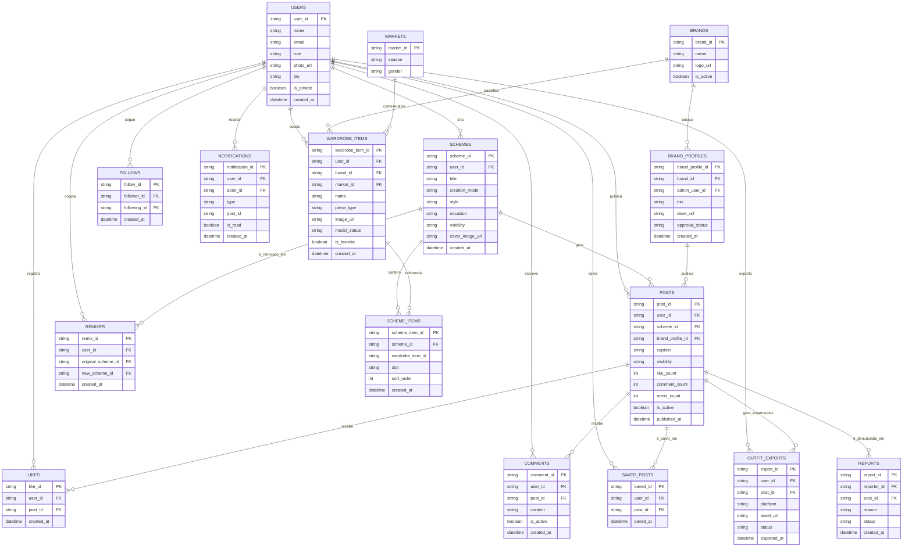

### Descrição das Coleções / Tabelas Sociais

| Tabela | Descrição |
|---|---|
| `posts` | Publicações de esquemas de moda no feed comunitário, vinculadas a um `scheme_id`. |
| `likes` | Curtidas de usuários em publicações — relação N:M entre `users` e `posts`. |
| `comments` | Comentários de usuários em publicações, com campo de conteúdo textual e flag de ativo. |
| `remixes` | Rastreia relação de derivação entre scheme original e novo scheme remixado. |
| `follows` | Relacionamento de seguidor/seguido entre usuários — relação N:M reflexiva em `users`. |
| `saved_posts` | Coleção de publicações salvas por usuário para acesso rápido futuro. |
| `notifications` | Central de notificações sociais (curtidas, comentários, remixes, novos seguidores). |
| `outfit_exports` | Registro de exportações de outfit cards para plataformas externas. |
| `brand_profiles` | Perfis de marcas varejistas cadastrados na aba Maison, vinculados a `brands`. |
| `reports` | Denúncias de conteúdo inadequado, encaminhadas para fila de moderação. |

---

## 8. DIAGRAMAS UML

### 8.1 Diagrama de Casos de Uso

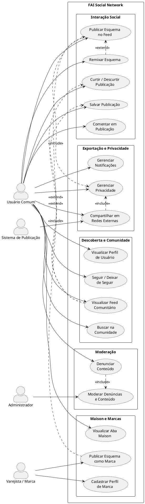

---

### 8.2 Diagrama de Classes

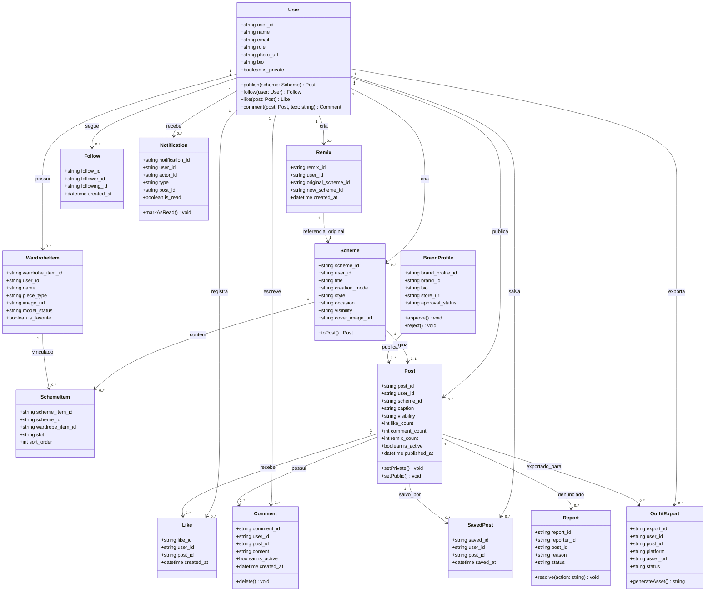

---

### 8.3 Diagrama ER — Atividade: Publicar e Engajar com Esquema no Feed

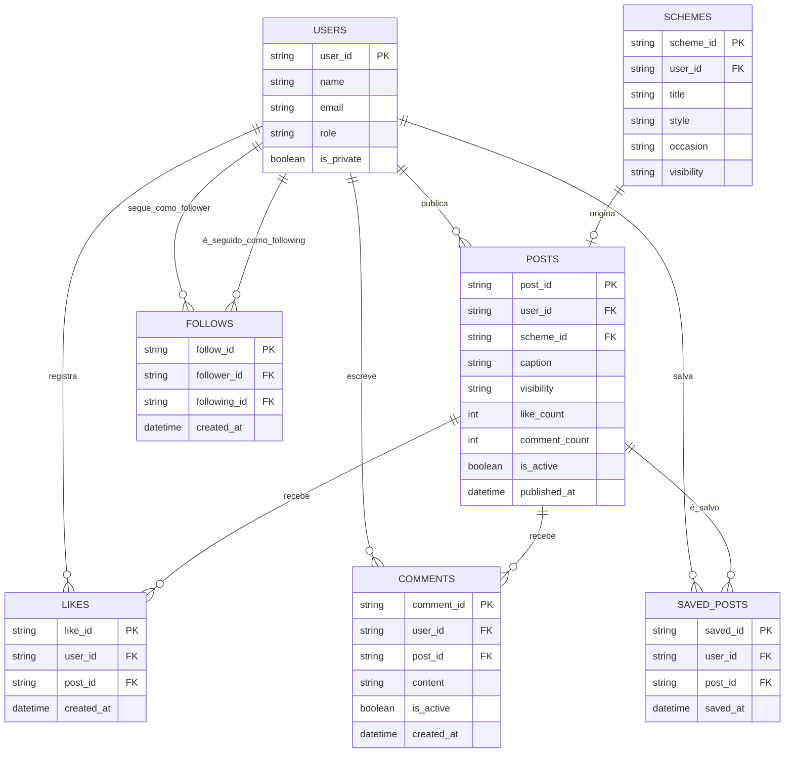

---

### 8.4 Diagramas de Atividades

#### Atividade 1 — Publicar Esquema no Feed Comunitário

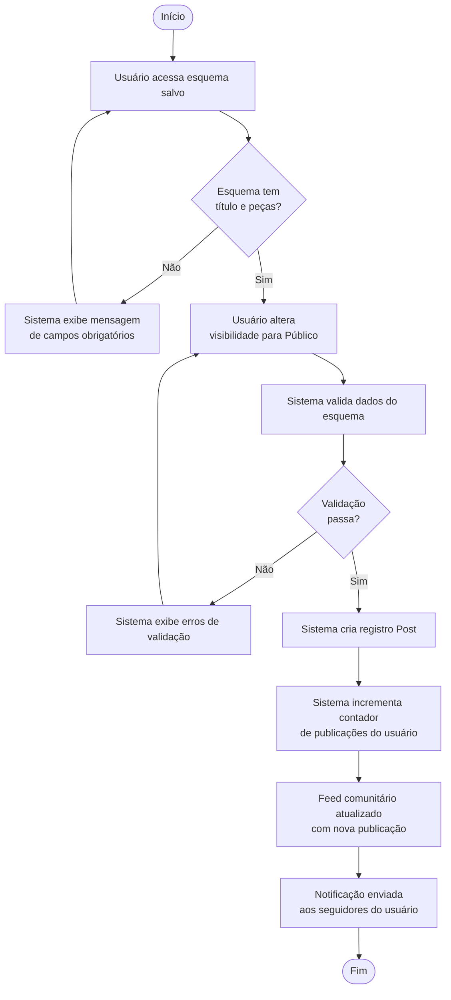

#### Atividade 2 — Remixar Esquema de Outro Usuário

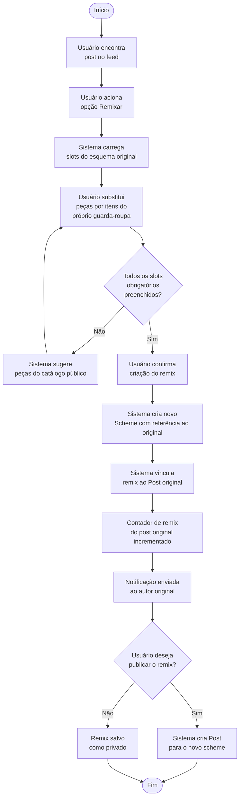

#### Atividade 3 — Exportar Outfit Card para Rede Social Externa

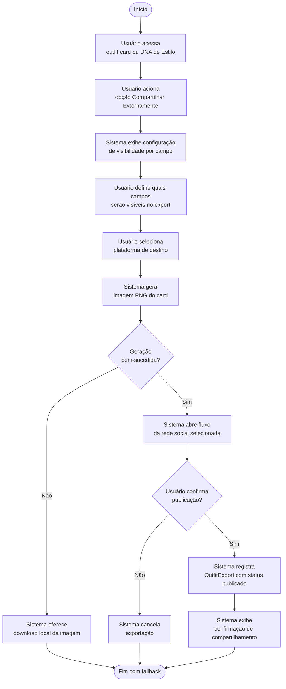

---

### 8.5 Diagramas de Sequência

#### Sequência 1 — Publicar Esquema no Feed

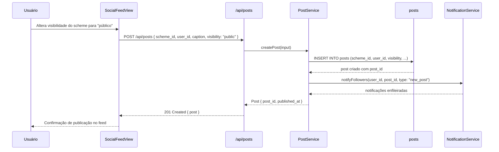

#### Sequência 2 — Curtir Publicação no Feed

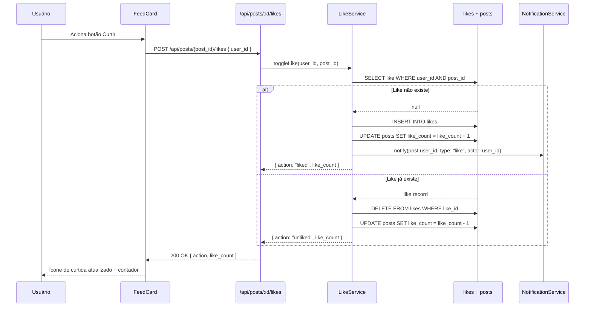

#### Sequência 3 — Remixar Esquema de Outro Usuário

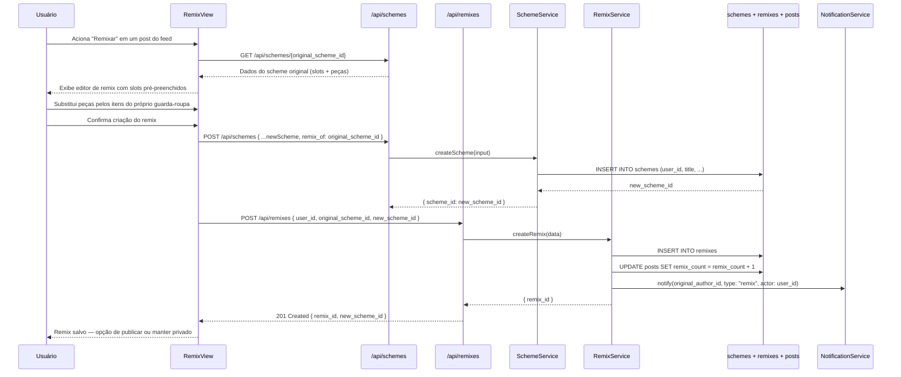

#### Sequência 4 — Exportar Outfit Card para Plataforma Externa

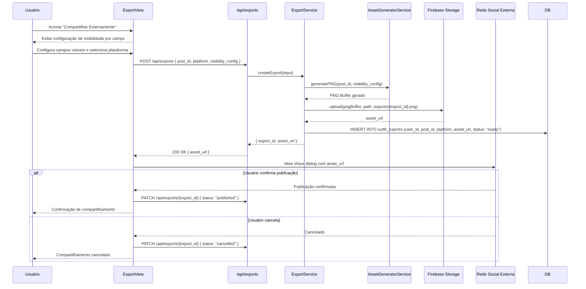

---

## 9. ANALYTICS

### Objetivo de Negócios

A rede social do Fashion AI visa monitorar o engajamento da comunidade com o conteúdo de moda publicado, identificar os criadores mais influentes, as tendências de estilo emergentes e os padrões de interação (curtidas, comentários, remixes, exportações). O objetivo é embasar decisões de produto — como melhorar o algoritmo de feed, incentivar a adoção da aba Maison e aumentar a taxa de exportação — além de fornecer métricas de valor para marcas parceiras mensurarem seu alcance orgânico dentro da plataforma.

### Fontes de Dados

| Fonte | Dados coletados |
|---|---|
| `posts` | Volume de publicações por período, estilo, ocasião e usuário. |
| `likes` | Taxa de curtidas por publicação, por estilo e por faixa horária. |
| `comments` | Volume e sentimento de comentários por publicação. |
| `remixes` | Taxa de remix por esquema — indicador de conteúdo viral interno. |
| `follows` | Crescimento de seguidores por usuário e por marca Maison. |
| `outfit_exports` | Volume e plataforma de destino de exportações — indicador de viralidade externa. |
| `saved_posts` | Taxa de salvamento — indicador de conteúdo de alta qualidade. |
| `reports` | Frequência de denúncias por categoria — indicador de saúde da comunidade. |

### Processo de ETL

1. **Extração:** Coleta periódica (horária) dos eventos de interação (likes, comments, remixes, exports) e dados de publicações ativas.
2. **Transformação:** Normalização de categorias de estilo e ocasião; cálculo de taxas de engajamento (likes/views, remixes/likes); agrupamento por período (dia, semana, mês), por tipo de ator (usuário comum vs. Maison) e por segmento de estilo.
3. **Limpeza:** Exclusão de posts inativos (`is_active = false`), deduplicação de curtidas e exportação de dados de contas suspensas.
4. **Carga:** Dados consolidados alimentam dashboards de monitoramento com atualização diária.

### Projeto de Dashboard

| Painel | Métricas Principais |
|---|---|
| **Engajamento do Feed** | Publicações/dia, curtidas médias por post, comentários médios por post, taxa de salvamento. |
| **Conteúdo Viral** | Top 10 posts por curtidas, top 10 por remixes, taxa de remix (remixes / total de posts). |
| **Crescimento da Comunidade** | Novos usuários/semana, novos seguidores/usuário, usuários que publicaram ao menos 1 post. |
| **Maison / Marcas** | Alcance por marca, seguidores de perfis Maison, posts de marca no top engajamento. |
| **Exportação Externa** | Volume de exports por plataforma (Instagram, X, Pinterest), taxa de conclusão de exports. |
| **Saúde da Comunidade** | Volume de denúncias por semana, tempo médio de resolução, taxa de remoção de conteúdo. |

---

*Documento gerado como artefato da disciplina de Desenvolvimento Ágil de Produto I — PUCPR · 2026*
