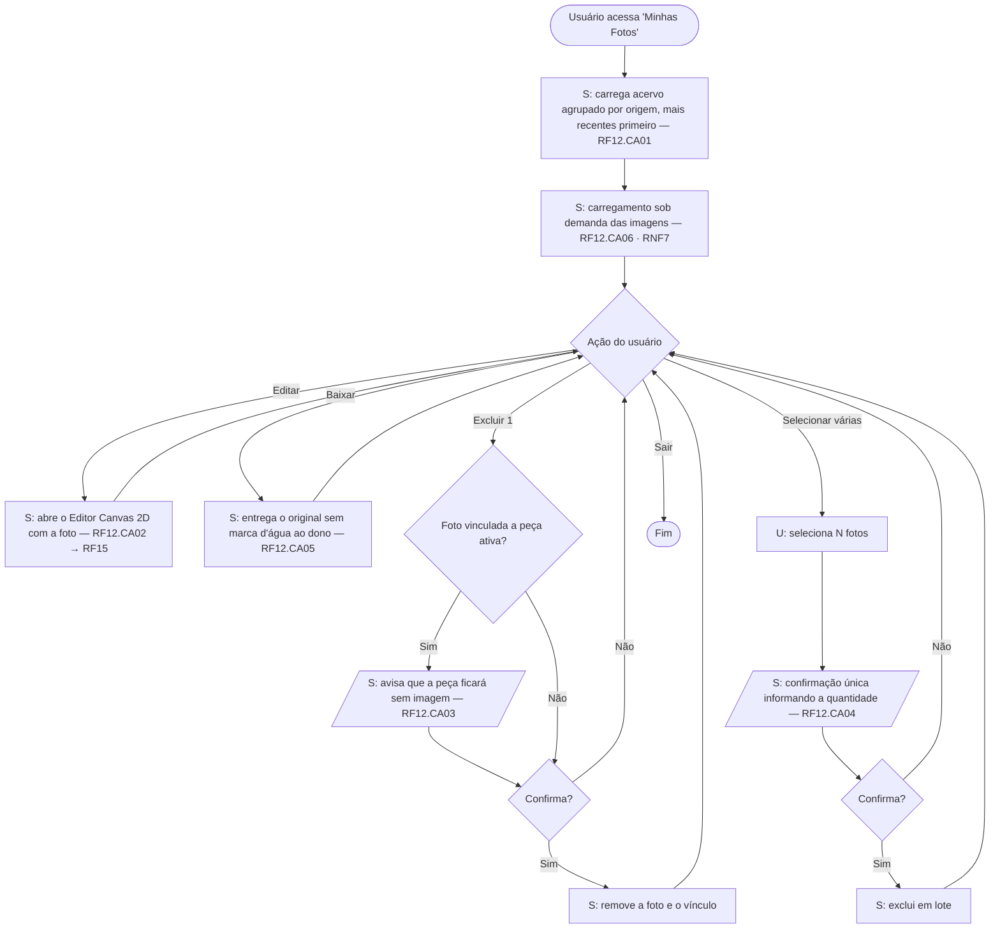
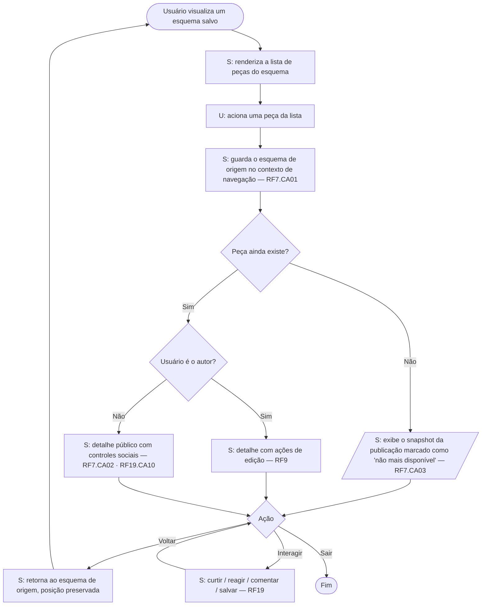
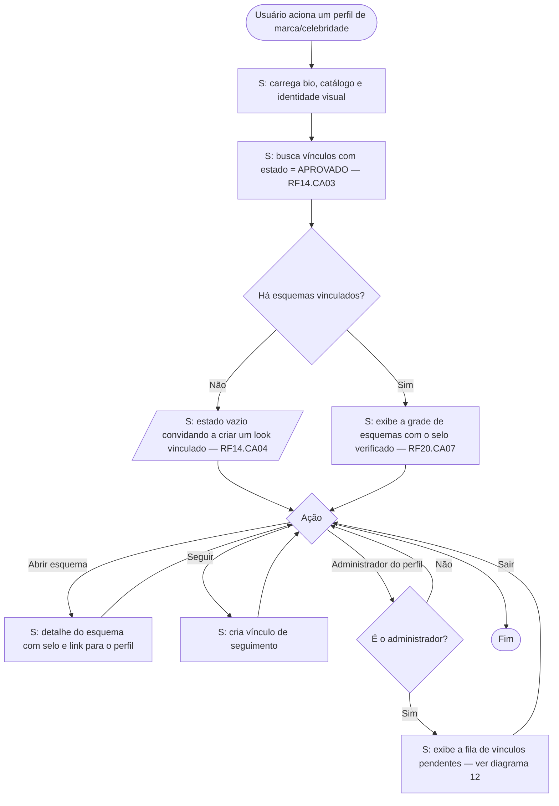
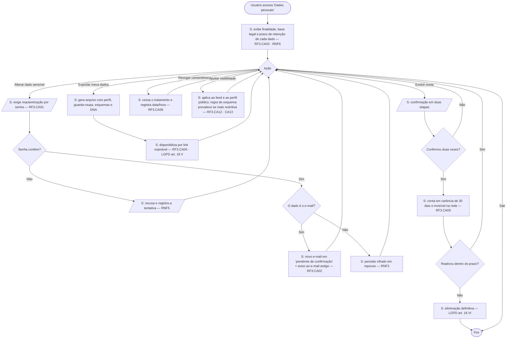
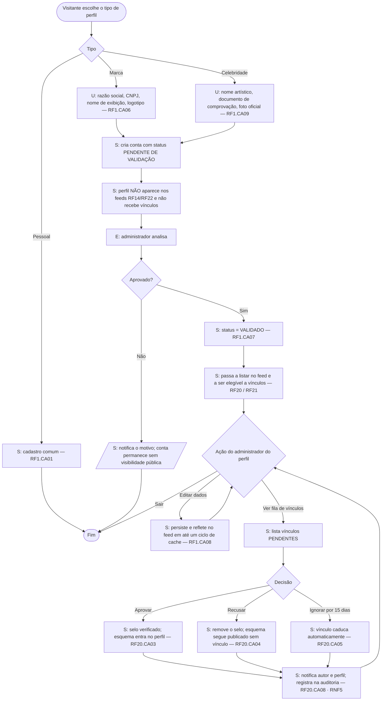

# Etapa 8 — Diagramas de Atividade por Requisito Funcional

Notação: Mermaid `flowchart` (renderiza no GitHub e nos artefatos). Cada diagrama traz, nas caixas de saída, o **CA** que o fluxo satisfaz — é isso que torna o diagrama verificável e não apenas ilustrativo.

Convenção de raias: `[U]` ação do usuário · `[S]` ação do sistema · `[E]` serviço externo · `◇` decisão.

---

## 1. RF10 — Copilot (recomendações por IA)


---

## 2. RF13 — DNA de Estilo


---

## 3. RF12 — Minhas Fotos



---

## 4. RF8 + RF17 — Buscar/Explorar e acessar o perfil de um usuário


---

## 5. RF7 — Acessar peça a partir da lista de um esquema



---

## 6. RF9 — Editar os dados de um esquema de vestimenta e suas peças


---

## 7. RF31 — Filtros favoritar / disponível / indisponível / todos dentro de um esquema


> **Regra de consistência (RF31.CA06/CA07).** *Favoritar* é um sinalizador booleano independente, desenhado como estrelinha pequena no padrão Spotify. *Disponível* e *indisponível* são estados mutuamente exclusivos — a interface nunca permite os dois ao mesmo tempo — e *indisponível* é compacto, só a letra. Os três ficam na **faixa superior** do card; **"todos" não é toggle de card**, é o filtro da lista, no header, ao lado do filtro de ocasião.

---

## 8. RF14 / RF22 — Feed de busca de marcas e de celebridades


---

## 9. RF14.CA03 / RF22 — Perfil de marca ou celebridade



---

## 10. RF3 — Alterar dados do perfil (dados sensíveis + direitos LGPD)



> ✅ **Confrontado com o material de padrões de interface LGPD** (anexo do RNF6, arquivado em `insumos/lgpd/`). O fluxo dos direitos do titular estava correto. A fonte acrescenta quatro regras de forma, agora exigíveis:
>
> 1. **Privacy by Default** — a conta nasce privada e com todo consentimento opcional desligado (RF3.CA19); o diagrama assume esse estado inicial.
> 2. **Granularidade** — "Revogar consentimento" é sempre *por finalidade*, nunca um botão único de "revogar tudo" (RF3.CA20).
> 3. **Simetria de esforço** — revogar tem o mesmo número de passos de conceder (RF3.CA21, art. 8º, §5º).
> 4. **Exportação legível por máquina** — o nó de exportação entrega JSON, não PDF (RF3.CA24, art. 18, V).

---

## 11. RF23 — Alterar dados **não sensíveis** e preferências de interface

```mermaid
flowchart TD
    A([Usuário acessa 'Preferências']) --> B[S: carrega tema, idioma, densidade, fonte, acessibilidade]
    B --> C{Ação}
    C -- Alterar tema/idioma/densidade/fonte --> D[S: aplica imediatamente e persiste entre dispositivos — RF23.CA02] --> C
    C -- Alto contraste / reduzir animações --> E[S: aplica em todas as telas — RF23.CA05] --> C
    C -- Alterar nome de exibição, bio, avatar ou capa --> F[S: persiste SEM reautenticação — RF23.CA03] --> C
    C -- Alterar @ --> G{@ disponível?}
    G -- Não --> H[/S: recusa e sugere alternativas — RF23.CA04/] --> C
    G -- Sim --> I[S: atualiza o @ e mantém redirecionamento do antigo por 30 dias] --> C
    C -- Navegar por teclado --> J[S: foco visível em todo controle interativo — RF23.CA06 · RNF7] --> C
    C -- Sair --> Z([Fim])
```

> A distinção **RF3 × RF23** é a que elimina a ambiguidade histórica: RF3 trata do dado que identifica a pessoa (exige reautenticação, tem base legal, entra no relatório LGPD); RF23 trata do dado de vitrine e da preferência de uso (não exige reautenticação).

---

## 12. RF1.CA06–CA10 *(ex-RF27/RF28)* — Cadastrar e gerenciar perfil de marca ou celebridade



---

## 13. RF3.CA15–CA18 *(ex-RF26)* — Receber e gerenciar notificações


---

## 14. RF18 — Provador 2D com manequim masculino/feminino


---

## 15. RF17 — Visualizar perfil com as postagens de outro usuário

> Fluxo detalhado no **diagrama 4** (nós `N` a `U`). Mantido lá para não duplicar a lógica de visibilidade, que é a mesma do feed.

---

## Cobertura

| RF | Diagrama | RF | Diagrama |
|---|---|---|---|
| RF1 (ex-RF27/RF28) | 12 | RF14 / RF22 | 8 e 9 |
| RF3 — dados pessoais | 10 | RF17 | 4 |
| RF3 (ex-RF26) — notificações | 13 | RF18 | 14 |
| RF7 | 5 | RF19 | 4, 5, 7 |
| RF8 | 4 | RF20 / RF21 | 12 |
| RF9 | 6 | RF23 | 11 |
| RF10 | 1 | RF31 (ex-RF19 filtros) | 7 |
| RF12 | 3 | RF13 | 2 |

**Ainda sem diagrama de atividade** (não estavam na lista da Etapa 8, mas fecham a cobertura do board): RF2, RF4, RF5, RF6, RF11, RF15, RF16. Recomendo gerá-los no Bloco 6 do plano guiado, reutilizando o mesmo padrão.
