# Etapa 8 — Diagramas de Atividade por Requisito Funcional

Notação: Mermaid `flowchart` (renderiza no GitHub e nos artefatos). Cada diagrama traz, nas caixas de saída, o **CA** que o fluxo satisfaz — é isso que torna o diagrama verificável e não apenas ilustrativo.

Convenção de raias: `[U]` ação do usuário · `[S]` ação do sistema · `[E]` serviço externo · `◇` decisão.

---

## 1. RF10 — Copilot (recomendações por IA)

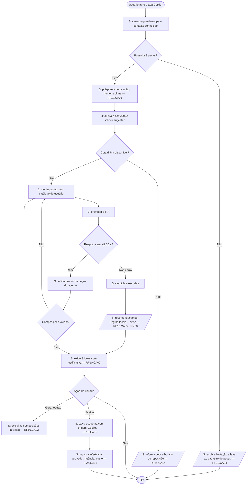

---

## 2. RF13 — DNA de Estilo

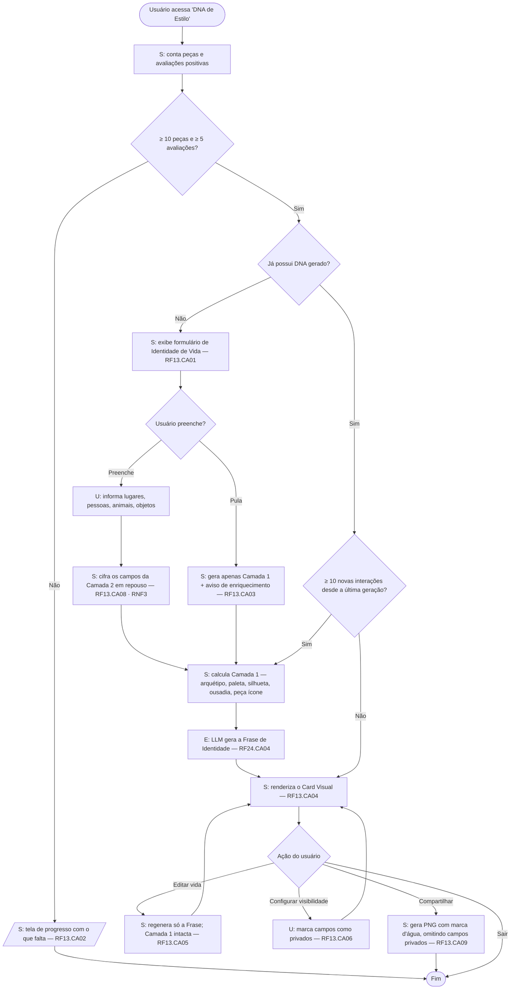

---

## 3. RF12 — Minhas Fotos


---

## 4. RF8 + RF17 — Buscar/Explorar e acessar o perfil de um usuário

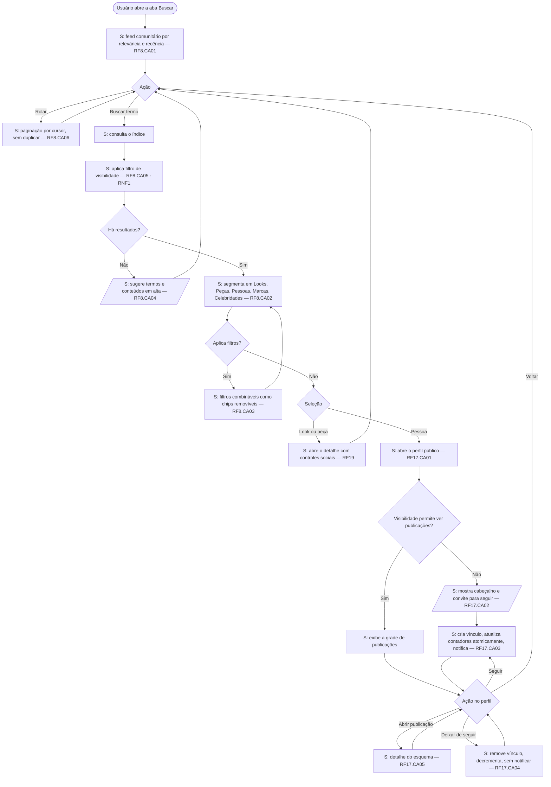

---

## 5. RF7 — Acessar peça a partir da lista de um esquema


---

## 6. RF9 — Editar os dados de um esquema de vestimenta e suas peças

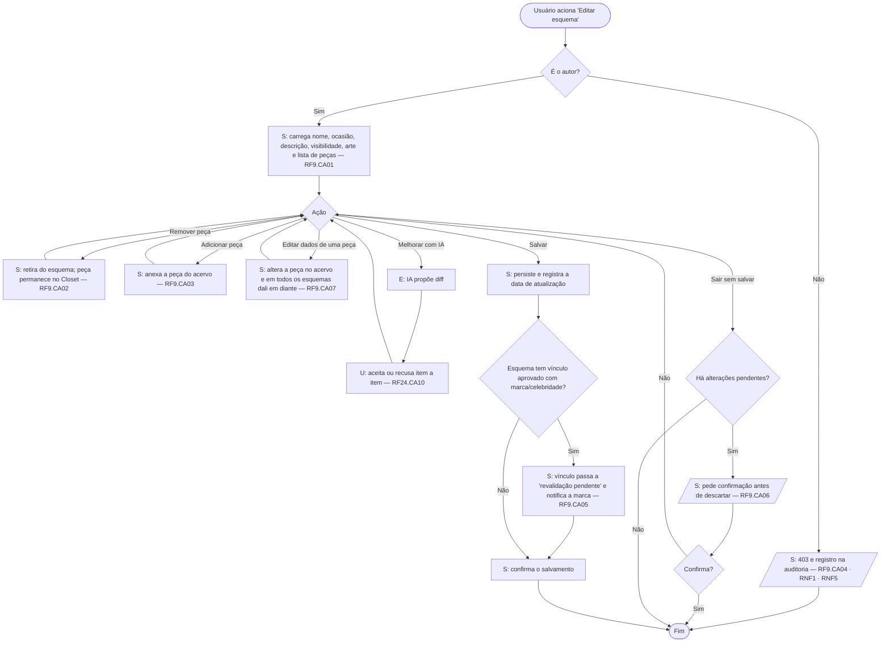

---

## 7. RF31 — Filtros favoritar / disponível / indisponível / todos dentro de um esquema

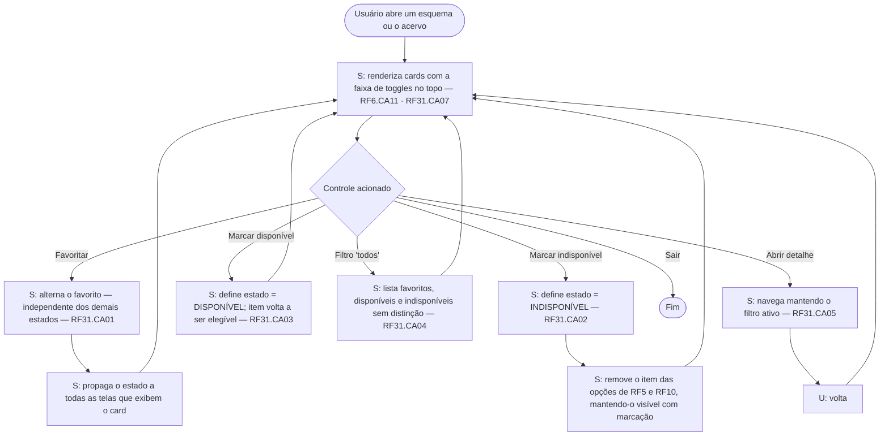

> **Regra de consistência (RF31.CA06/CA07).** *Favoritar* é um sinalizador booleano independente, desenhado como estrelinha pequena no padrão Spotify. *Disponível* e *indisponível* são estados mutuamente exclusivos — a interface nunca permite os dois ao mesmo tempo — e *indisponível* é compacto, só a letra. Os três ficam na **faixa superior** do card; **"todos" não é toggle de card**, é o filtro da lista, no header, ao lado do filtro de ocasião.

---

## 8. RF14 / RF22 — Feed de busca de marcas e de celebridades

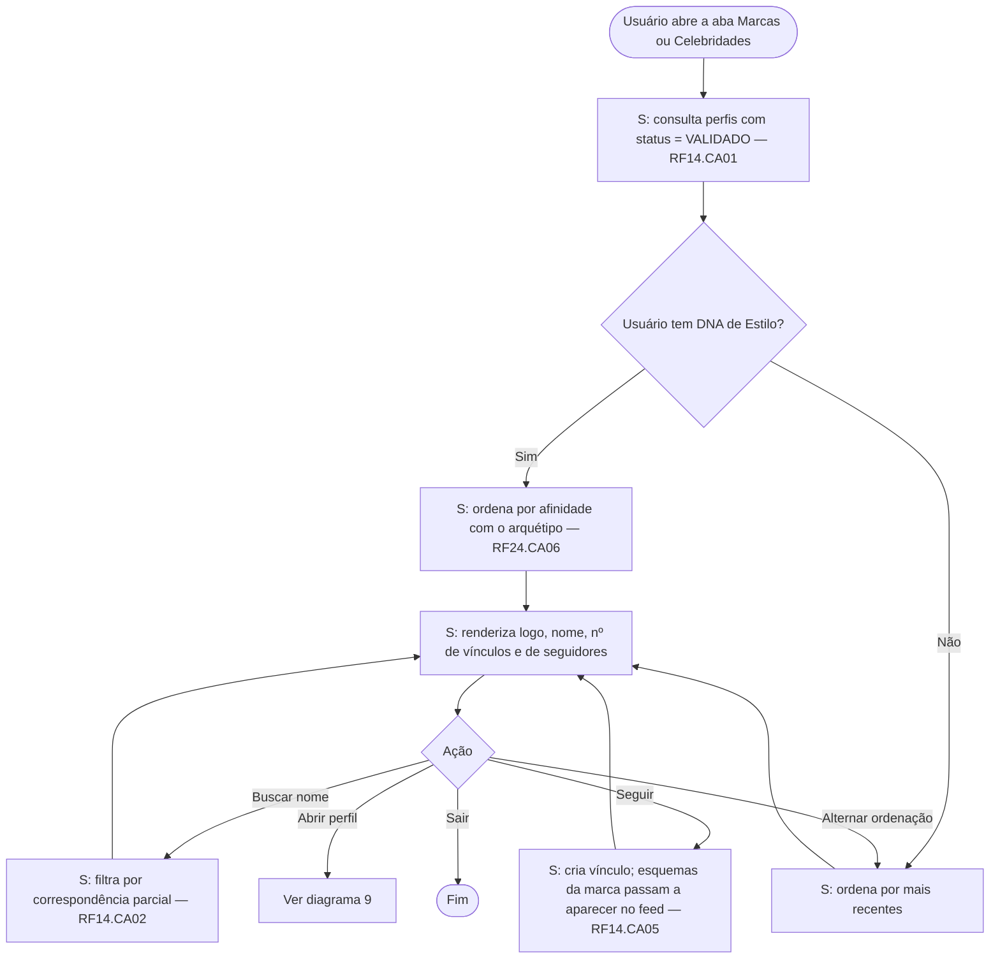

---

## 9. RF14.CA03 / RF22 — Perfil de marca ou celebridade


---

## 10. RF3 — Alterar dados do perfil (dados sensíveis + direitos LGPD)


> ✅ **Confrontado com o material de padrões de interface LGPD** (anexo do RNF6, arquivado em `insumos/lgpd/`). O fluxo dos direitos do titular estava correto. A fonte acrescenta quatro regras de forma, agora exigíveis:
>
> 1. **Privacy by Default** — a conta nasce privada e com todo consentimento opcional desligado (RF3.CA19); o diagrama assume esse estado inicial.
> 2. **Granularidade** — "Revogar consentimento" é sempre *por finalidade*, nunca um botão único de "revogar tudo" (RF3.CA20).
> 3. **Simetria de esforço** — revogar tem o mesmo número de passos de conceder (RF3.CA21, art. 8º, §5º).
> 4. **Exportação legível por máquina** — o nó de exportação entrega JSON, não PDF (RF3.CA24, art. 18, V).

---

## 11. RF23 — Alterar dados **não sensíveis** e preferências de interface

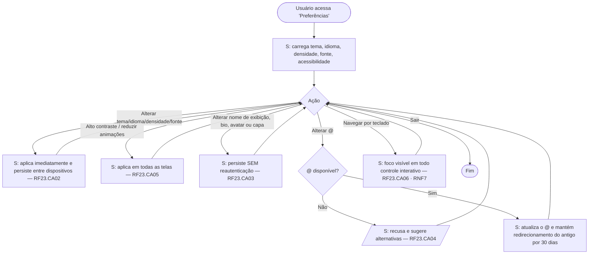

> A distinção **RF3 × RF23** é a que elimina a ambiguidade histórica: RF3 trata do dado que identifica a pessoa (exige reautenticação, tem base legal, entra no relatório LGPD); RF23 trata do dado de vitrine e da preferência de uso (não exige reautenticação).

---

## 12. RF1.CA06–CA10 *(ex-RF27/RF28)* — Cadastrar e gerenciar perfil de marca ou celebridade


---

## 13. RF3.CA15–CA18 *(ex-RF26)* — Receber e gerenciar notificações

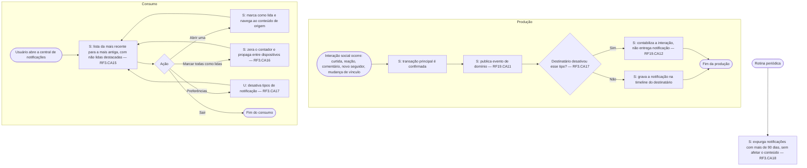

---

## 14. RF18 — Provador 2D com manequim masculino/feminino

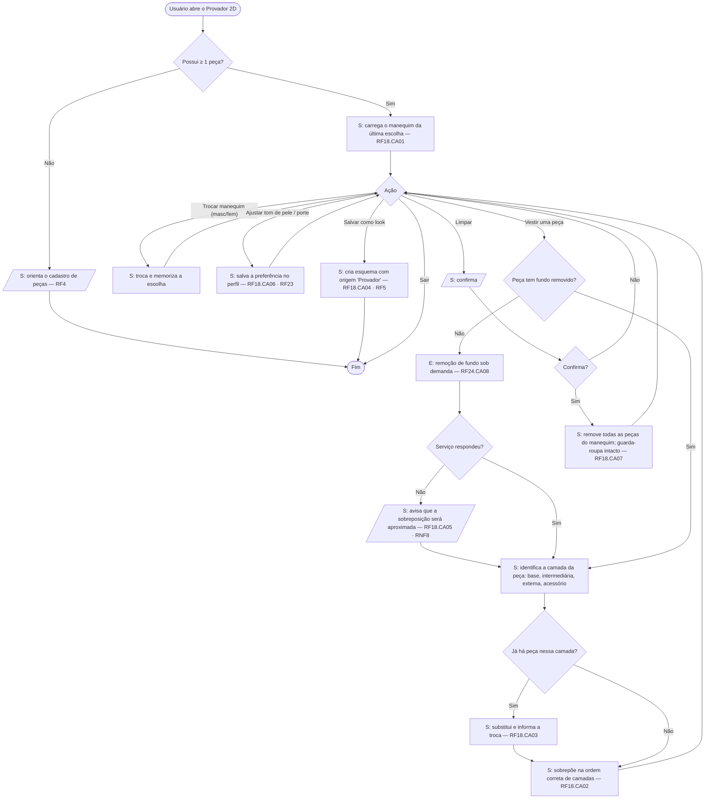

---

## 15. RF17 — Visualizar perfil com as postagens de outro usuário

> Fluxo detalhado no **diagrama 4** (nós `N` a `U`). Mantido lá para não duplicar a lógica de visibilidade, que é a mesma do feed.

---

## 16. RF2 — Autenticar usuário

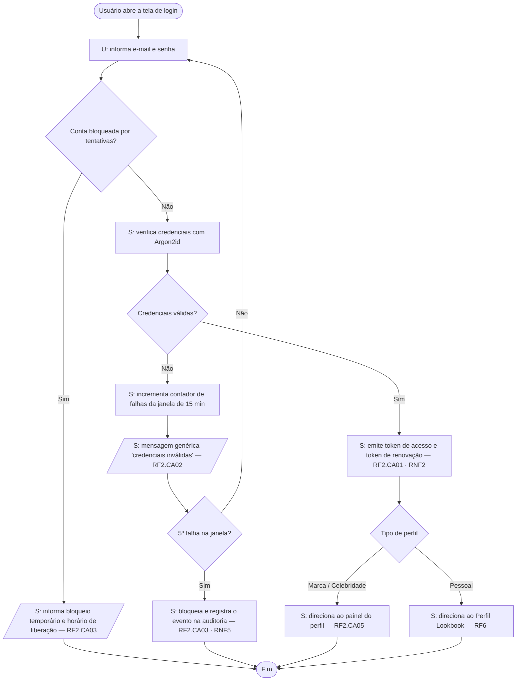

**Renovação transparente da sessão (RF2.CA04)** — executa fora do fluxo de login:

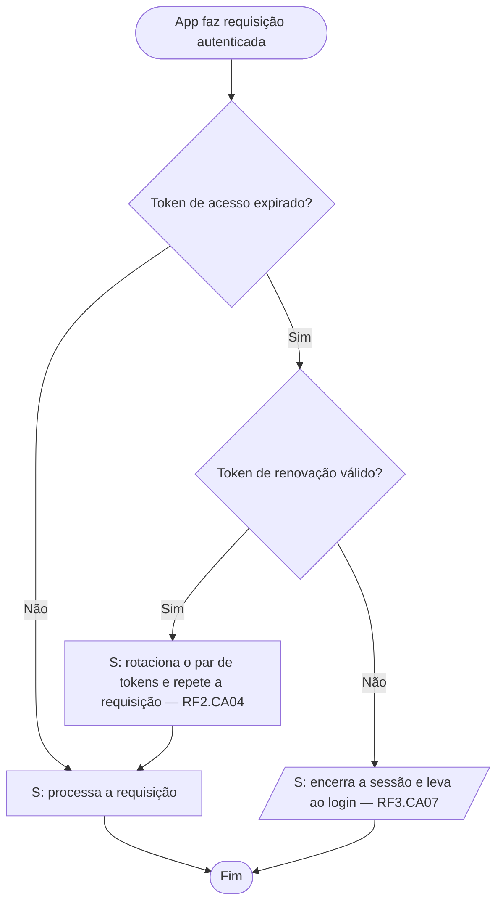

---

## 17. RF4 — Adicionar peça ao guarda-roupa

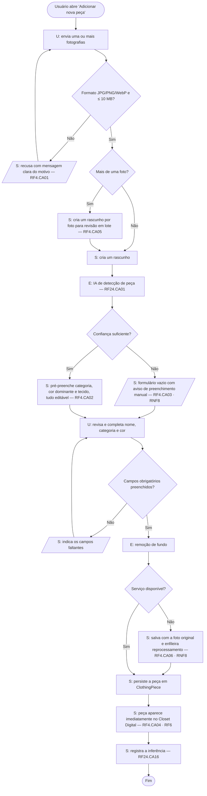

---

## 18. RF5 — Criar esquema de vestimenta (aba "Criar Look")

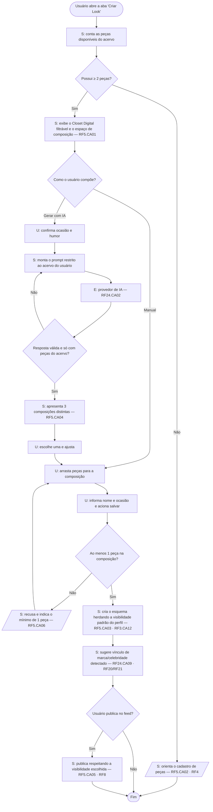

---

## 19. RF6 — Perfil Lookbook (Closet Digital + Looks Salvos)

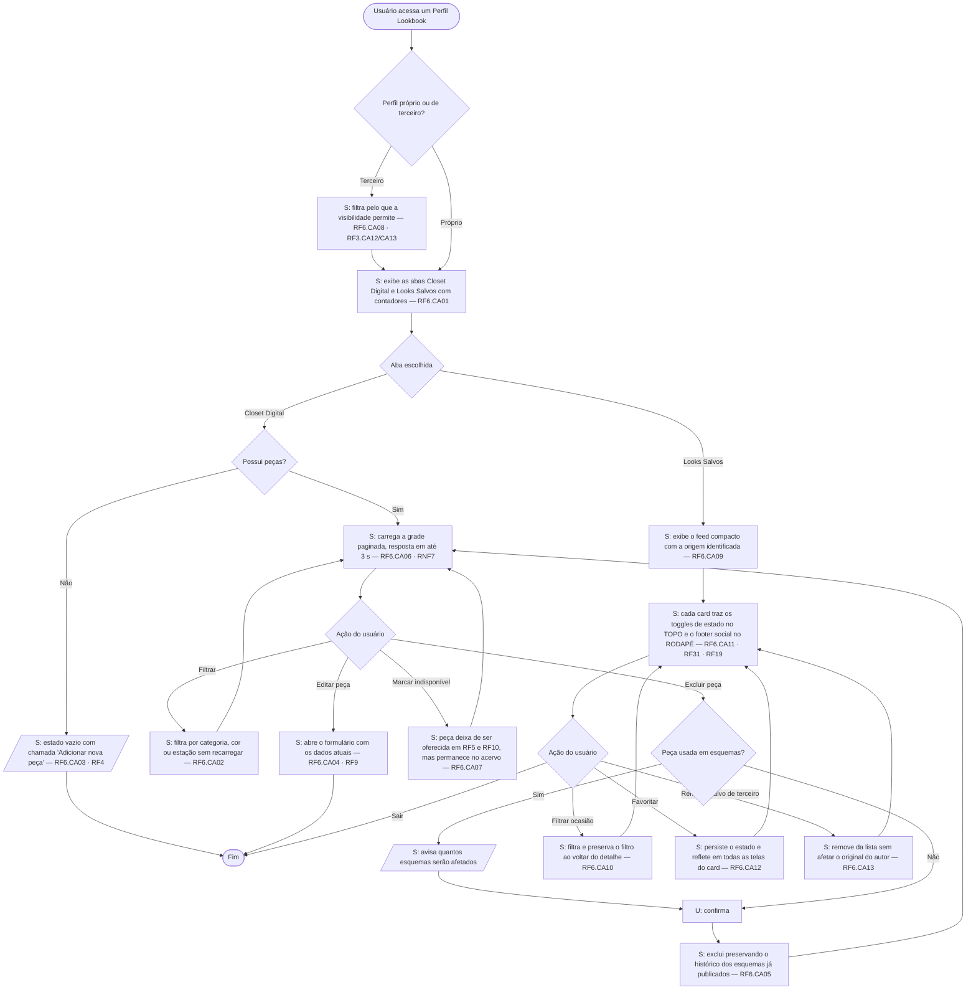

**Lookbook de celebridade — era como atmosfera (RF6.CA14).** É o subfluxo que a banca vai questionar, por isso está isolado:

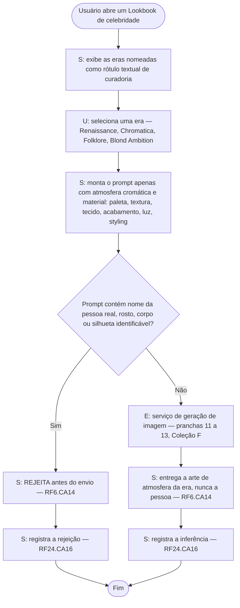

---

## 20. RF11 — Background Studio

```mermaid
flowchart TD
    A([Usuário edita um card de esquema ou peça]) --> B[U: abre o Background Studio]
    B --> C[S: exibe a galeria de fundos por categoria com pré-visualização em tempo real — RF11.CA01]
    C --> D{Origem do fundo}

    D -- Galeria --> E[U: escolhe um fundo] --> J
    D -- Imagem própria --> F[U: envia a imagem]
    F --> G{Formato e proporção válidos?}
    G -- Não --> H[/S: recusa indicando o motivo/] --> F
    G -- Sim --> I[S: recorta para o formato do card — RF11.CA04] --> J
    D -- Gerar por IA --> K[U: descreve o cenário]
    K --> L[E: provedor de geração de arte — RF24.CA07]
    L --> M{Resposta em até 30 s?}
    M -- Não --> N[/S: informa o andamento do job sem travar a tela — RF11.CA03 · RNF8/] --> L
    M -- Sim --> O[S: entrega a arte gerada — RF11.CA03] --> J
    D -- Remover fundo --> P[S: card volta ao fundo padrão sem perder os demais dados — RF11.CA05] --> Z([Fim])

    J[S: valida a legibilidade do texto sobreposto nos temas claro e escuro]
    J --> Q{Contraste suficiente nos dois temas?}
    Q -- Não --> R[/S: avisa e sugere ajuste ou outro fundo/] --> D
    Q -- Sim --> S1[S: salva o card com o fundo aplicado — RF11.CA02]
    S1 --> T[S: registra a inferência quando houve IA — RF24.CA16] --> Z
```

---

## 21. RF15 — Editor Canvas Interativo 2D · **Tema Futuro**

> ⚠️ Card marcado com o label **TEMAS FUTUROS** no board. O diagrama existe para fechar a cobertura e dimensionar o esforço; não é compromisso de sprint.

```mermaid
flowchart TD
    A([Usuário abre uma foto no editor]) --> B[S: carrega a imagem e a pilha de histórico — RF15.CA01]
    B --> C{Ferramenta escolhida}
    C -- Recorte / rotação / brilho / contraste --> D[S: aplica a transformação e empilha no histórico] --> H
    C -- Remoção de fundo --> E[E: serviço de remoção de fundo]
    E --> F{Serviço respondeu?}
    F -- Não --> G[/S: informa a falha e mantém as demais ferramentas operantes — RF15.CA04 · RNF8/] --> C
    F -- Sim --> D
    C -- Desfazer --> I[S: retrocede um passo, até o estado original, sem encerrar a sessão — RF15.CA03] --> H
    H{Usuário continua editando?}
    H -- Sim --> C
    H -- Não --> J{Salvar ou sair?}
    J -- Sair --> K[U: confirma a saída]
    K --> L[S: descarta as edições e preserva a imagem original íntegra — RF15.CA05] --> Z([Fim])
    J -- Salvar --> M[S: a imagem editada substitui a exibida na peça]
    M --> N[S: a original permanece em 'Minhas Fotos' — RF15.CA02 · RF12] --> Z
```

---

## 22. RF16 — Geração 3D das peças · **Tema Futuro** *(stretch goal)*

> ⚠️ Card marcado com o label **TEMAS FUTUROS**. Dependência de API 3D externa e de custo por job — é o requisito de maior risco do board.

```mermaid
flowchart TD
    A([Usuário abre uma peça com fotografia válida]) --> B[U: solicita a geração 3D]
    B --> C{Cota de uso disponível?}
    C -- Não --> D[/S: informa a cota e o horário de reposição — RF24.CA14/] --> Z([Fim])
    C -- Sim --> E[S: cria o job no estado 'enfileirado' — RF16.CA01]
    E --> F[S: exibe o estado do job na peça: enfileirado → processando → concluído → falhou]
    F --> G[E: serviço externo de geração 3D]
    G --> H{Resultado}
    H -- Falha ou tempo limite --> I[S: atualiza o estado para 'falhou' com motivo legível — RF16.CA03 · RNF8]
    I --> J{Reprocessamento gratuito já usado?}
    J -- Não --> K[U: reprocessa uma vez sem custo — RF16.CA03] --> G
    J -- Sim --> L[/S: mantém a versão 2D como alternativa/] --> Z
    H -- Sucesso --> M[S: persiste o modelo e marca o job como 'concluído']
    M --> N[S: exibe o modelo 3D com rotação e zoom, com a versão 2D disponível — RF16.CA02]
    N --> O[S: registra a inferência: provedor, latência, custo — RF24.CA16] --> Z

    P([Usuário fecha o app durante o processamento]) --> Q[U: reabre o app depois]
    Q --> R[S: recupera o estado do job do servidor, não do dispositivo — RF16.CA04] --> F
```

---

## Cobertura

| RF | Diagrama | RF | Diagrama |
|---|---|---|---|
| RF1 (ex-RF27/RF28) | 12 | RF13 | 2 |
| RF2 | **16** | RF14 / RF22 | 8 e 9 |
| RF3 — dados pessoais | 10 | RF15 | **21** *(Tema Futuro)* |
| RF3 (ex-RF26) — notificações | 13 | RF16 | **22** *(Tema Futuro)* |
| RF4 | **17** | RF17 | 4 |
| RF5 | **18** | RF18 | 14 |
| RF6 | **19** *(inclui o subfluxo RF6.CA14)* | RF19 | 4, 5, 7 |
| RF7 | 5 | RF20 / RF21 | 12 |
| RF8 | 4 | RF23 | 11 |
| RF9 | 6 | RF24 — motor de IA | transversal: 1, 17, 18, 19, 20, 22 |
| RF10 | 1 | RF31 (filtros do esquema) | 7 |
| RF11 | **20** | RF12 | 3 |

**Cobertura completa.** Todos os RFs efetivos do board têm diagrama de atividade. Os diagramas 16 a 22 fecharam as lacunas que restavam (RF2, RF4, RF5, RF6, RF11, RF15, RF16).

O **RF24** não recebe diagrama próprio de propósito: ele é o motor transversal de IA, e cada uma de suas capacidades é exercida *dentro* do fluxo do RF que a consome — é por isso que os CAs do RF24 aparecem como caixas de saída nos diagramas dos outros requisitos, e não isolados. A única exceção destacada é o subfluxo de **direito de imagem** do RF6.CA14, separado no diagrama 19 justamente porque é o ponto que a banca tende a questionar.
