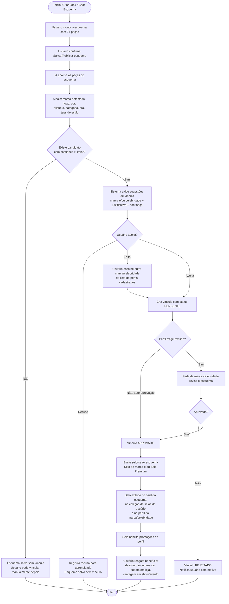

# RF20 / RF21 — Vínculo de Esquema com Marca e Celebridade (Selos e Promoções)

Reescrita dos requisitos **RF20** (vínculo com marca de roupa) e **RF21** (vínculo com
celebridade) sob a perspectiva de **fluxo de atividades**, encadeando:

> **Criar Look** → *a IA analisa as peças e sugere o vínculo* → **usuário aceita** →
> *o sistema emite o(s) selo(s) no esquema* → **selos habilitam promoções** do perfil da
> marca/celebridade (descontos em e-commerce, lojas físicas, shows e eventos).

As descrições dos requisitos foram **encurtadas** propositalmente (cabem em um card de
backlog); toda a regra de negócio está detalhada nos **Critérios de Aceite** e nas seções
de apoio (fluxo, modelo de dados, endpoints e regras).

---

## 1. Texto curto dos requisitos (para o card do backlog)

| # | Requisito Funcional | Ator / Usuário | Depende de | Sprint |
|---|---|---|---|---|
| RF20 | Vincular um esquema de vestimenta a uma **marca de roupa** cadastrada, a partir de sugestão da IA na criação do look, obtendo o **Selo de Marca** que dá acesso às promoções da marca | Usuário Comum / Varejista (Marca) | RF5, RF7, RF14, RF27 | 4 |
| RF21 | Vincular um esquema de vestimenta a uma **celebridade** verificada, a partir de sugestão da IA na criação do look, obtendo o **Selo Premium** que dá acesso às promoções da celebridade | Usuário Comum / Celebridade Verificada | RF5, RF7, RF20 | 4 |

**RF20 — descrição curta:**
Permitir que, ao criar um esquema de vestimenta, o usuário receba da IA uma sugestão de
vínculo com marca de roupa cadastrada (baseada na análise das peças do look) e, ao aceitá-la,
o esquema receba um **selo da marca** que comprova o vínculo e habilita as promoções
publicadas no perfil dessa marca.

**RF21 — descrição curta:**
Permitir que, ao criar um esquema de vestimenta, o usuário receba da IA uma sugestão de
vínculo com celebridade verificada (baseada na análise das peças e da assinatura de estilo
da celebridade) e, ao aceitá-la, o esquema receba um **Selo Premium** da celebridade que
comprova o vínculo e habilita as promoções publicadas no perfil dessa celebridade.

---

## 2. Histórias de Usuário

### HU — RF20: Vínculo com marca de roupa
**COMO:** usuário autenticado no Fashion AI
**POSSO:** aceitar a sugestão da IA de vincular meu esquema de vestimenta a uma marca de
roupa cadastrada na plataforma
**PARA:** receber o selo único dessa marca no meu esquema, comprovando o vínculo e me dando
acesso às promoções que a marca publica em seu perfil

### HU — RF21: Vínculo com celebridade
**COMO:** usuário autenticado no Fashion AI
**POSSO:** aceitar a sugestão da IA de vincular meu esquema de vestimenta a uma celebridade
verificada da aba Art Celebrity
**PARA:** receber o Selo Premium dessa celebridade no meu esquema, comprovando o vínculo e
me dando acesso às promoções que a celebridade publica em seu perfil (descontos em shows,
lojas, e-commerce e eventos)

---

## 3. Fluxo de atividades

### 3.1 Visão geral (raias)

### 3.2 Sequência resumida (quem faz o quê)

| # | Ator | Atividade | Saída |
|---|---|---|---|
| 1 | Usuário | Cria o look em *Criar Esquema* (mín. 2 peças) | Esquema em rascunho |
| 2 | Sistema / IA | Analisa as peças (marca detectada, logo, paleta, silhueta, categoria, tags) | Vetor de sinais do look |
| 3 | Sistema / IA | Compara com marcas cadastradas (RF14/RF27) e com a assinatura de estilo de celebridades verificadas | Lista ordenada de candidatos com score e justificativa |
| 4 | Usuário | Aceita, edita ou recusa a sugestão | Vínculo pendente ou esquema sem vínculo |
| 5 | Marca / Celebridade | Revisa o vínculo (quando o perfil exige revisão) | Vínculo aprovado ou rejeitado |
| 6 | Sistema | Emite o(s) selo(s) ao esquema | Selo vinculado ao esquema e ao usuário |
| 7 | Marca / Celebridade | Publica promoções condicionadas a um selo | Campanha ativa |
| 8 | Usuário | Visualiza e resgata a promoção | Cupom/código de resgate |

---

## 4. Critérios de Aceite

### 4.1 RF20 — Vínculo com marca de roupa

**CA01 — Sugestão de vínculo gerada pela IA na criação do look**
- **DADO QUE** o usuário está autenticado e monta um esquema com no mínimo duas peças
- **QUANDO** confirma o salvamento/publicação do esquema
- **ENTÃO** o sistema executa a análise das peças (marca detectada, logotipo, cor dominante,
  categoria, silhueta e tags de estilo) e exibe até **3 sugestões** de marcas cadastradas,
  cada uma com **nome, logotipo, percentual de confiança e justificativa textual**
  (ex.: "3 de 5 peças identificadas como Marca X")

**CA02 — Aceite da sugestão**
- **DADO QUE** o sistema exibiu ao menos uma sugestão de marca
- **QUANDO** o usuário aceita uma delas
- **ENTÃO** o sistema registra o vínculo `esquema ↔ marca` com status **pendente** (ou
  **aprovado**, se a marca configurou auto-aprovação), exibe confirmação e mantém o esquema
  salvo mesmo que a revisão ainda não tenha ocorrido

**CA03 — Edição da sugestão**
- **DADO QUE** o usuário discorda das marcas sugeridas
- **QUANDO** aciona "escolher outra marca"
- **ENTÃO** o sistema apresenta a lista pesquisável de marcas cadastradas na aba Maison e
  permite vincular o esquema à marca escolhida manualmente, registrando a origem do vínculo
  como **manual**

**CA04 — Recusa da sugestão**
- **DADO QUE** o sistema exibiu sugestões de vínculo
- **QUANDO** o usuário recusa todas
- **ENTÃO** o esquema é salvo **sem vínculo**, a recusa é registrada como sinal de
  aprendizado e o usuário pode solicitar o vínculo depois pela tela de detalhe do esquema

**CA05 — Nenhum candidato com confiança suficiente**
- **DADO QUE** nenhuma marca atinge o limiar mínimo de confiança configurado
- **QUANDO** a análise termina
- **ENTÃO** o sistema não exibe sugestão automática, salva o esquema normalmente e oferece
  apenas a opção de vínculo manual

**CA06 — Marca não cadastrada**
- **DADO QUE** a IA identifica uma marca que **não possui perfil** cadastrado na plataforma
- **QUANDO** a sugestão seria gerada
- **ENTÃO** o sistema não oferece vínculo com essa marca e informa que somente marcas com
  perfil cadastrado (RF14/RF27) podem conceder selos

**CA07 — Revisão pelo perfil da marca**
- **DADO QUE** existe um vínculo com status pendente
- **QUANDO** o administrador do perfil da marca acessa a fila de revisão
- **ENTÃO** visualiza o esquema, as peças e os sinais que motivaram a sugestão, e pode
  **aprovar** ou **rejeitar com motivo**, sendo o usuário notificado em ambos os casos

**CA08 — Emissão do selo**
- **DADO QUE** o vínculo foi aprovado
- **QUANDO** a aprovação é registrada
- **ENTÃO** o sistema emite um **Selo de Marca** único e rastreável (identificador, marca
  emissora, esquema de origem, data de emissão e validade), exibindo-o no card do esquema,
  na coleção de selos do perfil do usuário e na galeria de looks consagrados do perfil da marca

**CA09 — Selo único por par esquema/marca**
- **DADO QUE** o esquema já possui selo emitido por determinada marca
- **QUANDO** um novo vínculo com a mesma marca é solicitado para o mesmo esquema
- **ENTÃO** o sistema não duplica o selo e informa que o vínculo já existe

**CA10 — Múltiplos selos no mesmo esquema**
- **DADO QUE** o look combina peças de marcas diferentes, todas cadastradas
- **QUANDO** o usuário aceita mais de uma sugestão
- **ENTÃO** o sistema emite **um selo por marca aprovada** e o card do esquema exibe todos
  os selos obtidos, sem limite de exibição diferente do definido no layout do card

**CA11 — Promoção habilitada pelo selo**
- **DADO QUE** o usuário possui um selo válido de determinada marca
- **QUANDO** acessa o perfil da marca ou a área "Meus Selos"
- **ENTÃO** visualiza as promoções vinculadas àquele selo (desconto em e-commerce, cupom
  para loja física, frete, brinde ou acesso antecipado a coleção), com **regras, validade e
  quantidade restante**

**CA12 — Resgate da promoção**
- **DADO QUE** existe promoção ativa para um selo que o usuário possui
- **QUANDO** ele aciona "resgatar"
- **ENTÃO** o sistema gera um **código de resgate único**, registra data/hora e usuário,
  decrementa o estoque da campanha e impede novo resgate acima do limite por usuário

**CA13 — Promoção indisponível**
- **DADO QUE** a promoção está expirada, esgotada ou o selo do usuário foi revogado
- **QUANDO** ele tenta resgatar
- **ENTÃO** o sistema bloqueia o resgate e informa o motivo específico, sem gerar código

**CA14 — Revogação e expiração do selo**
- **DADO QUE** a marca identifica uso indevido, ou o esquema é excluído/tornado privado, ou
  o prazo de validade do selo termina
- **QUANDO** o evento ocorre
- **ENTÃO** o selo passa a **revogado/expirado**, deixa de habilitar promoções, é sinalizado
  como inativo na coleção do usuário e os cupons já resgatados permanecem válidos até sua
  própria data de expiração

**CA15 — Visibilidade e privacidade**
- **DADO QUE** o esquema vinculado tem visibilidade privada ou restrita a seguidores
- **QUANDO** um visitante sem permissão acessa o perfil da marca
- **ENTÃO** o esquema não é exibido na galeria pública da marca, mas o selo continua válido
  para o usuário proprietário

**CA16 — Rastreabilidade e auditoria**
- **DADO QUE** um vínculo foi criado, aprovado, rejeitado ou revogado
- **QUANDO** a operação é concluída
- **ENTÃO** o sistema registra em log a origem do vínculo (sugestão da IA ou manual), o score
  de confiança, o responsável pela decisão e o carimbo de data/hora

### 4.2 RF21 — Vínculo com celebridade

Valem todos os critérios **CA01 a CA16** de RF20, substituindo "marca" por "celebridade
verificada", acrescidos dos critérios específicos abaixo.

**CA17 — Base da sugestão de celebridade**
- **DADO QUE** o usuário criou um esquema com no mínimo duas peças
- **QUANDO** a análise da IA é executada
- **ENTÃO** a sugestão de celebridade considera a **assinatura de estilo** do perfil
  verificado (tags de estilo, era/temporada, paleta, silhueta e peças-ícone dos looks
  consagrados) e apresenta a justificativa em linguagem natural
  (ex.: "silhueta e paleta compatíveis com a era Blond Ambition")

**CA18 — Somente celebridades verificadas**
- **DADO QUE** apenas perfis com selo de verificação podem conceder Selo Premium
- **QUANDO** a lista de sugestões é montada
- **ENTÃO** perfis não verificados nunca aparecem como candidatos, nem na busca manual de vínculo

**CA19 — Consentimento e direito de imagem**
- **DADO QUE** o vínculo associa publicamente o look de um usuário à imagem de uma pessoa real
- **QUANDO** o vínculo é criado
- **ENTÃO** ele permanece **pendente até aprovação explícita** do perfil da celebridade (a
  auto-aprovação de CA02 **não se aplica** a RF21), e o perfil pode revogar o selo a qualquer
  momento, com o esquema deixando de ser exibido em sua galeria

**CA20 — Selo Premium**
- **DADO QUE** o vínculo com a celebridade foi aprovado
- **QUANDO** o selo é emitido
- **ENTÃO** ele é identificado como **Selo Premium**, visualmente distinto do Selo de Marca,
  exibindo o nome/handle da celebridade e a era do look consagrado

**CA21 — Promoções de celebridade**
- **DADO QUE** o usuário possui um Selo Premium válido
- **QUANDO** acessa o perfil da celebridade
- **ENTÃO** visualiza promoções do tipo **desconto em ingressos de show, meet & greet,
  pré-venda, desconto em loja/e-commerce da celebridade ou de marca parceira e conteúdo
  exclusivo**, com regras, validade e quantidade restante

**CA22 — Promoção com marca parceira**
- **DADO QUE** a promoção da celebridade é operada por uma marca parceira cadastrada
- **QUANDO** o usuário resgata o benefício
- **ENTÃO** o código gerado identifica **celebridade emissora e marca executora**, e o resgate
  é contabilizado nas métricas de ambos os perfis

**CA23 — Limite de emissão por campanha**
- **DADO QUE** a celebridade define um teto de selos ou de resgates por período
- **QUANDO** o teto é atingido
- **ENTÃO** novos vínculos ficam em fila ou são recusados com mensagem explicativa, sem
  emissão de selo

---

## 5. Modelo de dados (proposta)

```mermaid
erDiagram
    USER ||--o{ SCHEME : cria
    SCHEME ||--o{ SCHEME_LINK : possui
    BRAND ||--o{ SCHEME_LINK : concede
    CELEBRITY ||--o{ SCHEME_LINK : concede
    SCHEME_LINK ||--o| SEAL : gera
    SEAL ||--o{ PROMOTION_REDEMPTION : habilita
    PROMOTION ||--o{ PROMOTION_REDEMPTION : origina
    BRAND ||--o{ PROMOTION : publica
    CELEBRITY ||--o{ PROMOTION : publica
    USER ||--o{ PROMOTION_REDEMPTION : resgata
```

| Entidade | Campos principais |
|---|---|
| `scheme_link` | `link_id`, `scheme_id`, `issuer_type` (`brand`/`celebrity`), `issuer_id`, `origin` (`ai_suggestion`/`manual`), `confidence`, `rationale`, `status` (`pending`/`approved`/`rejected`/`revoked`), `reviewed_by`, `reviewed_at`, `rejection_reason` |
| `seal` | `seal_id`, `link_id`, `scheme_id`, `user_id`, `issuer_type`, `issuer_id`, `seal_kind` (`brand_seal`/`premium_seal`), `issued_at`, `expires_at`, `status` (`active`/`expired`/`revoked`) |
| `promotion` | `promotion_id`, `issuer_type`, `issuer_id`, `required_seal_kind`, `required_issuer_id`, `type` (`ecommerce_discount`/`store_coupon`/`event_ticket`/`exclusive_content`), `rules`, `starts_at`, `ends_at`, `total_quota`, `per_user_limit`, `partner_brand_id` |
| `promotion_redemption` | `redemption_id`, `promotion_id`, `seal_id`, `user_id`, `code`, `redeemed_at`, `status` (`issued`/`used`/`expired`) |

Sinais já disponíveis no código atual e reaproveitados pela análise: `brand_id_detected`,
`brand_detection_confidence`, `brand_detection_source` (`manual`/`ocr`/`vision`/`hybrid`) das
peças do guarda-roupa, além das tags de estilo e paleta do esquema.

---

## 6. Endpoints (proposta)

| Método | Rota | Descrição |
|---|---|---|
| `POST` | `/api/schemes/{id}/link-suggestions` | Executa a análise das peças e retorna candidatos (marca/celebridade) com score e justificativa |
| `POST` | `/api/schemes/{id}/links` | Cria o vínculo aceito pelo usuário (origem IA ou manual) |
| `PATCH` | `/api/links/{linkId}` | Aprova, rejeita ou revoga o vínculo (perfil emissor) |
| `GET` | `/api/users/{id}/seals` | Lista os selos do usuário (ativos, expirados, revogados) |
| `GET` | `/api/brands/{id}/promotions` · `/api/celebrities/{id}/promotions` | Lista promoções do perfil, filtradas pelos selos do solicitante |
| `POST` | `/api/promotions/{id}/redeem` | Gera o código de resgate, validando selo, cota e limite por usuário |

---

## 7. Regras de negócio e não funcionais

1. A sugestão de vínculo é **não bloqueante**: o esquema é sempre salvo, com ou sem vínculo.
2. Limiar de confiança e política de auto-aprovação são **configuráveis por perfil de marca**;
   celebridade **sempre** exige aprovação humana (CA19).
3. A análise das peças deve responder em até **5 segundos**; ao exceder, o esquema é salvo e a
   sugestão é entregue de forma assíncrona por notificação.
4. Um selo é **intransferível**, vinculado ao par usuário/esquema que o originou.
5. Códigos de resgate são **únicos, de uso único** e não reutilizáveis entre campanhas.
6. Toda decisão automática exibe justificativa legível ao usuário (transparência da IA).
7. Métricas por perfil emissor: vínculos sugeridos, aceitos, aprovados, selos ativos,
   promoções resgatadas e taxa de conversão selo → resgate.

---

## 8. Rastreabilidade

| Item | Relação |
|---|---|
| RF5 / RF7 | Criação do esquema — ponto de entrada do fluxo |
| RF14 / RF27 | Cadastro e perfil da marca — pré-requisito do Selo de Marca |
| RF13 | Aba Maison — vitrine onde os selos e promoções da marca aparecem |
| RF21 | Aba Art Celebrity — perfis verificados e galeria de looks com Selo Premium |
| RF28 | Visibilidade do esquema — condiciona a exibição pública do look vinculado (CA15) |
