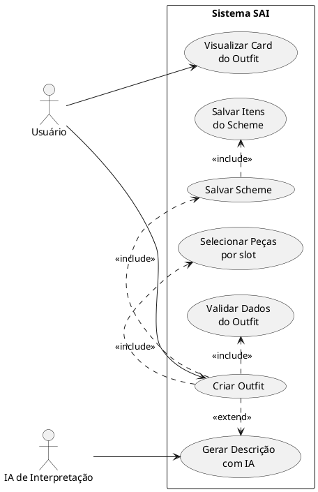
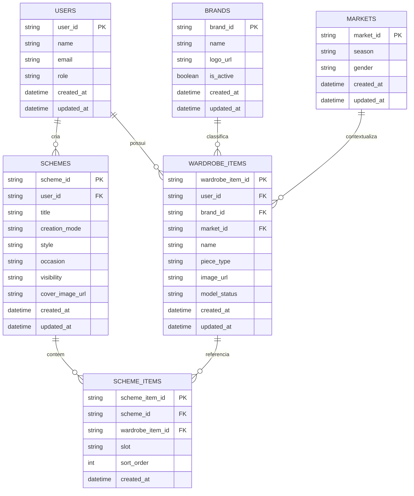
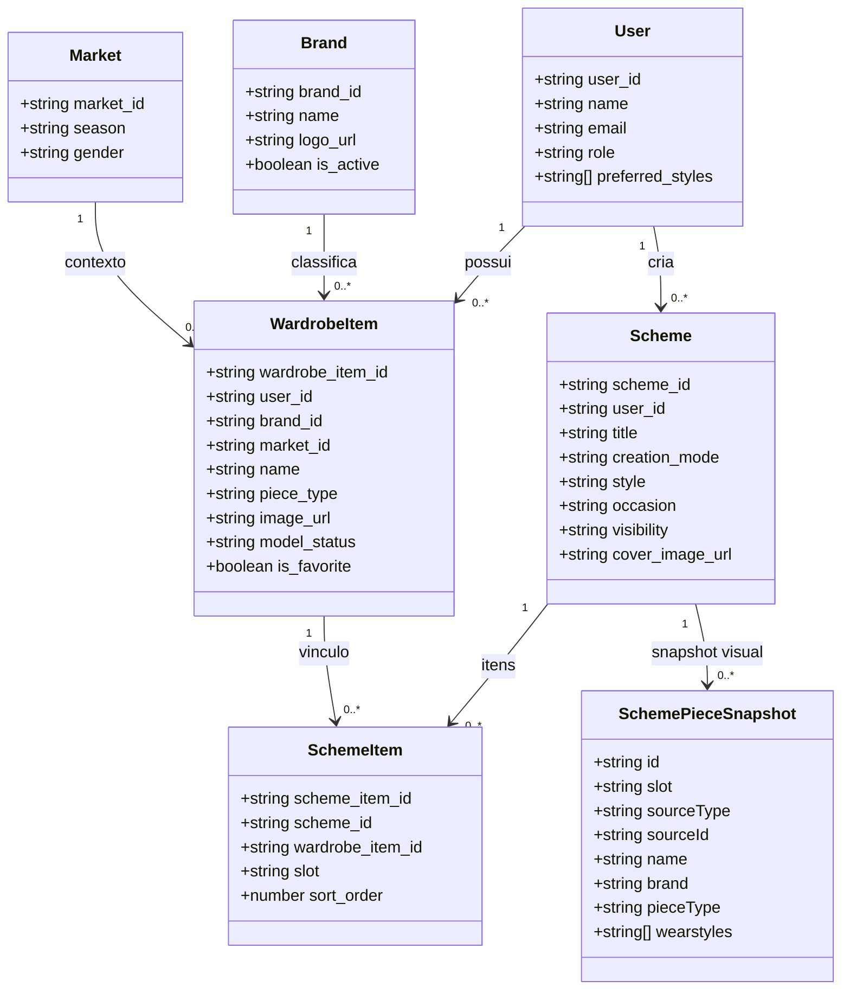

# Diagramas UML e Modelo de Dados — Caso de Uso Principal

Este documento descreve o caso de uso principal **"Criar e salvar um outfit (scheme)"** no sistema SAI, com três visões complementares:

1. **UML de Caso de Uso** (foco em atores e interações).
2. **Diagrama ER** (foco no modelo relacional e cardinalidades).
3. **Diagrama de Classes** (foco em estruturas de domínio e associações).

---

## 1) Diagrama UML de Caso de Uso (Principal)

Atores principais:
- **Usuário**: monta o outfit e solicita salvamento.
- **IA de Interpretação**: opcional para sugerir combinações a partir de prompt.

---

## 2) Diagrama ER (Entidade-Relacionamento)

Entidades centrais para o fluxo de criação/salvamento de outfit:
- `users`
- `schemes`
- `scheme_items`
- `wardrobe_items`
- `brands`
- `markets`

---

## 3) Diagrama de Classes (Domínio)

Diagrama orientado aos tipos de domínio usados no backend para criação e leitura de outfits.

---

## Observações de modelagem

- O caso de uso principal foi modelado em torno da jornada **criar + salvar** outfit, incluindo a extensão opcional por IA.
- O ER reflete persistência relacional; já o diagrama de classes mostra a estrutura de domínio consumida pelos serviços/repositórios.
- `SchemeItem` representa a relação entre `Scheme` e peças do guarda-roupa, permitindo ordenação por `slot` e `sort_order`.
