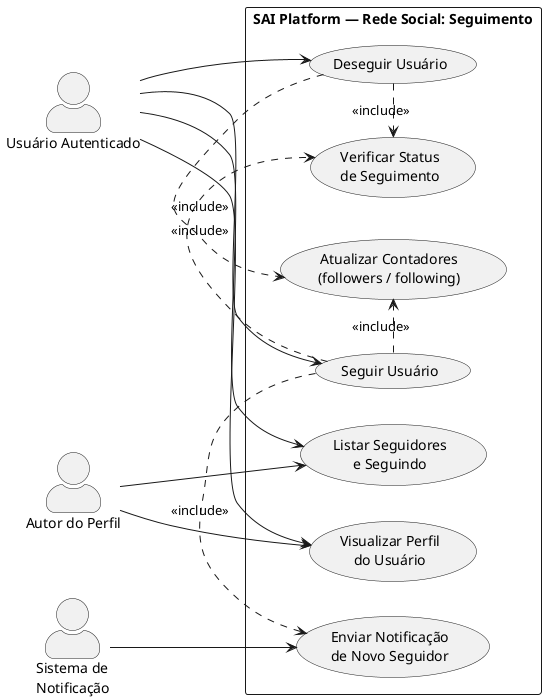
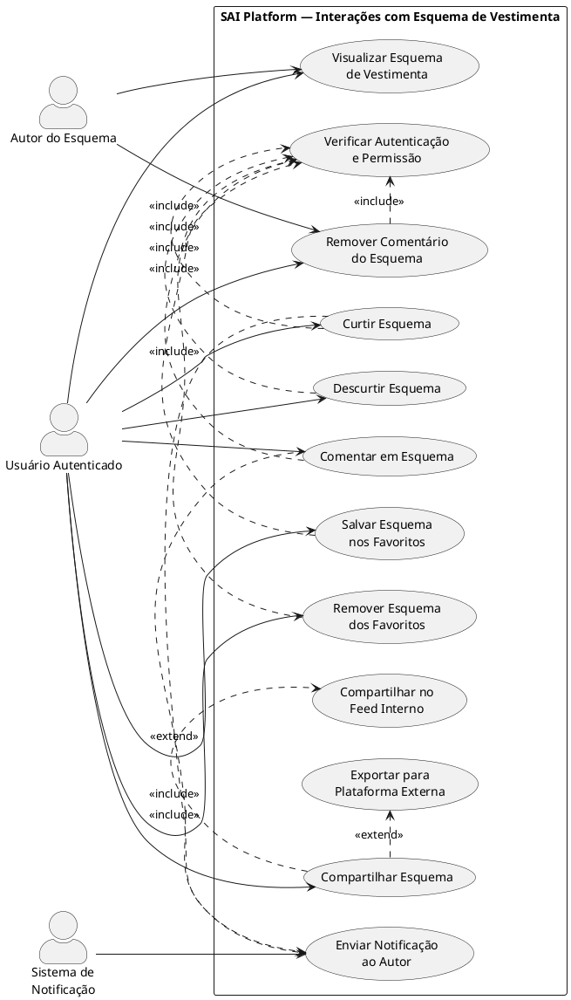
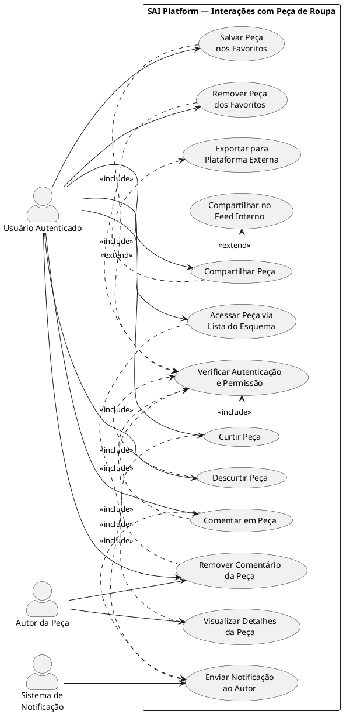

# Diagramas de Casos de Uso — Interações de Rede Social

Este documento descreve os casos de uso para as funcionalidades de interação social do SAI, cobrindo quatro categorias:

1. **Seguir / Deseguir Usuário**
2. **Curtir, Comentar, Salvar e Compartilhar Esquema de Vestimenta**
3. **Curtir, Comentar, Salvar e Compartilhar Peça de Roupa**

> **Relação Esquema ↔ Peça:** Uma peça de roupa é sempre um elemento do array `lista de peças de roupa` de um `Scheme`. As interações sociais disponíveis para a peça são idênticas às do esquema pai (curtir, comentar, salvar e compartilhar); a diferença está no ponto de acesso — a peça é alcançada a partir do card do esquema ao qual pertence.

---

## Atores

| Ator | Descrição |
|------|-----------|
| **Usuário Autenticado** | Usuário logado que executa as ações sociais |
| **Autor do Conteúdo** | Dono do esquema, da peça ou do perfil-alvo da interação |
| **Sistema de Notificação** | Serviço interno que dispara alertas ao autor quando há nova interação |

---

## 1) Seguir / Deseguir Usuário

Atores:
- **Usuário Autenticado**: inicia o seguimento ou cancela.
- **Autor do Perfil**: destinatário da ação de seguimento.
- **Sistema de Notificação**: envia alerta de novo seguidor.

---

## 2) Interações com Esquema de Vestimenta

Aplica-se a qualquer `Scheme` com visibilidade `public`.

Atores:
- **Usuário Autenticado**: realiza curtida, comentário, salvamento ou compartilhamento.
- **Autor do Esquema**: pode remover comentários no próprio conteúdo.
- **Sistema de Notificação**: notifica o autor a cada interação relevante.

---

## 3) Interações com Peça de Roupa

> **Contexto de acesso:** a peça de roupa (`WardrobeItem`) é sempre um elemento do array `lista de peças de roupa` de um `Scheme`. O usuário acessa a peça a partir do card do esquema ao qual ela pertence, via `UC_AcessarPecaViaEsquema`. A partir desse ponto, as funcionalidades de interação são idênticas às do esquema pai.

Atores:
- **Usuário Autenticado**: realiza curtida, comentário, salvamento ou compartilhamento na peça.
- **Autor da Peça**: pode remover comentários na própria peça.
- **Sistema de Notificação**: notifica o autor a cada interação relevante.

---

## Observações de Modelagem

- **Simetria Esquema ↔ Peça:** os casos de uso de interação social são intencionalmente simétricos entre `Scheme` e `WardrobeItem`. A diferença arquitetural está nas coleções Firestore: `saiOutfitLikes` / `saiOutfitComments` / `saiUserSavedSchemes` para esquemas; `saiPieceLikes` / `saiPieceStats` para peças.

- **Acesso via lista do esquema:** `UC_AcessarPecaViaEsquema` (Diagrama 3) reflete a restrição de domínio — uma `WardrobeItem` não possui página própria no feed; ela é sempre exibida dentro do card do `Scheme` que a contém (`SchemePieceSnapshot[]`).

- **Compartilhar vs. Exportar:** `UC_CompartilharNoFeedInterno` cria uma postagem na timeline do SAI (`saiUserPosts`). `UC_ExportarParaPlataformaExterna` gera um artefato de exportação (`saiOutfitExports`) para plataformas como Instagram, Facebook ou X.

- **Remoção de comentário:** tanto o autor do conteúdo quanto o autor do próprio comentário podem excluí-lo. Administradores possuem permissão de moderação (não detalhada neste diagrama).

- **`<<extend>>` em Compartilhar:** o tipo de compartilhamento (interno ou externo) é uma escolha do usuário em tempo de execução; por isso é modelado como `<<extend>>` e não `<<include>>`.

- **Contadores:** `UC_AtualizarContadores` no Diagrama 1 atualiza os campos `following_count` e `follower_count` da entidade `User` de forma atômica.
