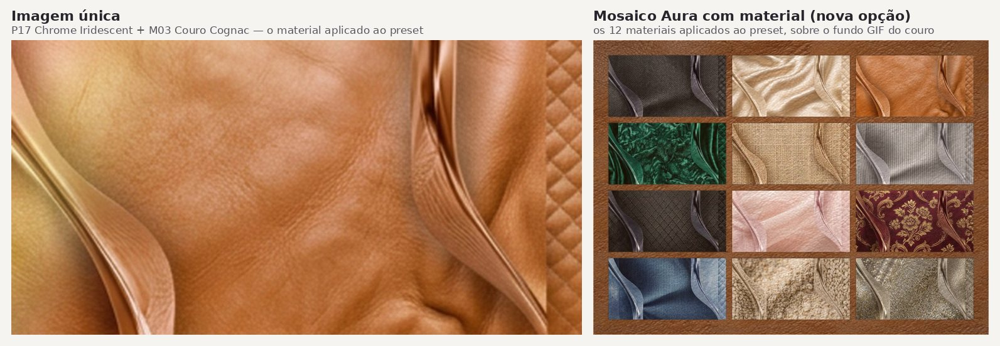

# RF11 — Proposta: Presets AURA e Materiais para "Arte com IA"

**Projeto:** FashionAI (SAI-TCC-2026)
**Requisito Funcional:** RF11 — Configurar o Visual do Card (Background Studio)
**Escopo:** Sub-fluxo **Arte com IA** → ramos `Direção visual recomendada → Preset Aura` e `Camada de material`, e a nova opção **Mosaico Aura com material** (seção 7)
**Base analisada:** `RF11-atividades.pdf`, `RF11-classes.pdf`, `RF11-componentes.pdf`, `RF11-maquinadeestados.pdf`, `RF11-sequencia.pdf`

---

## 1. Contexto — por que este ramo é "lógica comum a todos os tipos de geração"

Os cinco diagramas descrevem **o mesmo Background Studio** sendo reutilizado para os três tipos de card (`TipoCard = PECA | ESQUEMA | DNA_ESTILO`). A ramificação por tipo acontece só na Etapa 1 (carregamento de conteúdo); a partir da Etapa 2 em diante — organizar conteúdo, configurar background, `Arte com IA`, cor do container, revisão e persistência — o fluxo é **idêntico e compartilhado**, e isso está explícito:

- **Diagrama de Atividades:** as três origens (Peça / Esquema / DNA de Estilo) convergem em "Etapa 2 — Organizar o conteúdo do card" antes de entrar em "Etapa 3 — Configurar os elementos visuais", onde vive `Arte com IA`.
- **Diagrama de Estados:** os estados `Configurando arte com IA`, `Configurando background` e `Configurando container` são regiões concorrentes, reaproveitadas independentemente de `Card de peça`, `Card de DNA de Estilo` ou `Card de esquema`.
- **Diagrama de Classes:** `ConfiguracaoArteIA` é um *value object* único, com `ModoArteIA = MATERIAL | PROMPT | DIRECAO_VISUAL | PRESET_AURA`, associado a `ConfiguracaoVisual`, que por sua vez está ligado a `Card` — não há uma classe de configuração por tipo de card.
- **Diagrama de Sequência:** `AIArtworkService.generateArtwork(configuration)` e `ContextAnalysisService` são chamados da mesma forma, independentemente da origem do conteúdo (`ConteudoDoCard`).

Logo, qualquer preset AURA ou material proposto aqui **precisa funcionar igualmente bem** sobre uma peça isolada, um esquema completo de vestimenta ou um registro de DNA de Estilo — a curadoria não pode assumir contexto de peça única.

Dentro de `ModoArteIA`, dois ramos concentram decisão de *conteúdo visual* (em vez de geração livre por prompt):

| Modo | Diagrama de Atividades | Papel |
|---|---|---|
| `MATERIAL` ("Camada de material") | "Selecionar uma camada de material" → "Enviar a seleção ao serviço de IA" | Textura/superfície aplicada ao background |
| `PRESET_AURA` ("Preset Aura") | Alternativa a "Direção recomendada": "Sistema apresenta os presets Aura" → "Usuário seleciona um preset" → "IA gera a arte de background" | Direção visual/cromática pronta, sem exigir prompt |

Este documento propõe o **catálogo de conteúdo** para esses dois ramos — hoje representados no código apenas como esqueleto genérico (`presetAura: String [0..1]`, `material: String [0..1]` em `ConfiguracaoArteIA`).

> **Importante — Material e Preset Aura NÃO são excludentes.** Ver seção 3.3: o usuário pode combinar livremente qualquer preset AURA com qualquer material, à sua escolha. A matriz da seção 5 é apenas a combinação **padrão sugerida pela IA**, não uma restrição de uso.

---

## 2. Fundamentação em teoria de moda e design

As escolhas abaixo não são arbitrárias; seguem três eixos de teoria de moda/design amplamente usados em curadoria visual e styling:

**a) Teoria da cor aplicada a moda**
- **Roda de cores (Itten):** combinações **análogas** (harmonia, sofisticação), **complementares** (contraste, impacto editorial) e **monocromáticas** (minimalismo, luxo discreto) foram usadas deliberadamente em cada preset — nunca combinações aleatórias.
- **Paletas sazonais (color analysis / "estações" usadas em styling pessoal e moda):** *Spring* (quente, claro, vívido), *Summer* (frio, suave, empoeirado), *Autumn* (quente, terroso, profundo), *Winter* (frio, saturado, alto contraste). Cada AURA abaixo é ancorada em uma dessas famílias, o que garante coerência quando a IA cruzar a paleta do preset com a paleta das peças do usuário (`ConfiguracaoBackground`/`ContextAnalysisService.analisarCard`).

**b) Teoria têxtil (fibra, construção, caimento, acabamento)**
Cada material tem correspondência com uma **fibra e construção real** (tecido plano vs. malha, peso leve/médio/pesado, caimento estruturado vs. fluido, acabamento fosco vs. acetinado). Isso substitui nomes genéricos do catálogo atual (`lego_material`, `water_material`) por comportamento de tecido real, mapeável nos parâmetros já existentes em `FabricMaterialConfig` (`density`, `threadDirection`, `threadThickness`, `embossIntensity`, `surfaceContrast`, `finish`).

**c) Arquétipos de estilo (curadoria/visual merchandising)**
Cada preset e material é ancorado em um arquétipo de moda reconhecível — *Alfaiataria Clássica, Minimalismo Editorial, Romântico, Boêmio, Streetwear, Avant-garde, Esportivo/Athleisure, Glam de Noite, Dark Academia, Natural/Sustentável* — os mesmos vocabulários já usados no projeto (`ArtworkStylePreset`: `editorial_fashion`, `luxury_minimal`, `futuristic_sport`, `streetwear`, `monochrome_premium`; e `wearstyles`: `Statement Piece`, `Street Core`, `Trend Driver` etc.), garantindo que a proposta se encaixe no vocabulário estilístico que o sistema já usa para inferir estilo.

---

## 3. Proposta A — Presets AURA (com e sem GIF)

### 3.1 Relação com o sistema AURA existente

O código já possui um sistema chamado **Aura** (`app/lib/aura-system.ts`), mas com propósito de **gamificação por engajamento** (`RAW → NOTICED → RISING → HEAT → VIBRANT → ICONIC → LEGENDARY`, escalonado por número de likes) e presets de gradiente animado em `OutfitBackgroundStudioModal.tsx` (`GIF_GRADIENT_PRESETS`, categorias `aura / heat`, `aura / vibrant`, `aura / iconic`, `aura / legendary`).

Isso **não deve ser confundido** com o ramo `PRESET_AURA` do RF11, que é uma **escolha direta de direção visual de moda** feita pelo usuário — independente de likes — dentro de `Arte com IA`. A proposta abaixo:

- **Mantém** o sistema de engajamento (`aura-system.ts`) intocado — ele resolve outro problema (recompensa social).
- **Introduz** um catálogo próprio de `PRESET_AURA`, ancorado em arquétipo de moda + paleta sazonal, para o campo `presetAura` de `ConfiguracaoArteIA`.
- **Reaproveita a infraestrutura técnica** já pronta: os *keyframes* CSS (`aura-heat-pulse`, `aura-vibrant-rotate`, `aura-iconic-shimmer`, `aura-legendary-holo`, `aura-particle-float`) e o padrão `GifGradientPreset` (`type`, `angle`, `stops`, `image?`) já implementados — cada preset abaixo tem uma **versão estática** (aplicada direto ao `background_mode: 'gradient'`) e uma **versão GIF** (mesma paleta + animação), replicando exatamente o toggle que já existe (`dynamicBackground` / "Ative a Aura para animar como GIF").

### 3.2 Material e Preset Aura são combináveis, não alternativos

Lidos ao pé da letra, os diagramas de Atividades e de Máquina de Estados modelam `ModoArteIA` como **uma escolha única** por geração: "Qual recurso de IA?" abre um leque de ramos mutuamente exclusivos (`Camada de material` **|** `Prompt` **|** `Direção visual` **|** `Preset Aura`), todos convergindo no mesmo `Gerando arte` → `Arte aplicada`. Interpretado assim, escolher `Preset Aura` e escolher `Camada de material` seriam de fato alternativas — como a pergunta original aponta.

**Isso não é como o material já funciona na implementação atual**, e não é como material e cor/mood funcionam em moda real:

- **No código (`app/lib/outfit-card.ts`):** `materialLayer` é um campo **independente** de `background_mode`. `applyFabricMaterialToCard()` só *adiciona* `materialLayer` à config existente — nunca substitui `ai_artwork`, `gradient` ou `solid_color`. Ou seja, hoje já é tecnicamente possível aplicar um material por cima de um artwork gerado por IA (incluindo um preset Aura).
- **Em teoria têxtil/design de moda:** tecido e direção cromática nunca são "ou/ou" — toda peça tem simultaneamente um tecido (linho, cetim, veludo...) **e** uma paleta/mood. Tratar "Camada de material" como alternativa a "Preset Aura" no seletor de recurso da IA contraria a própria lógica de design que este documento usa para justificar os presets.

**Recomendação:** desacoplar `material` das demais opções de `ModoArteIA` no seletor de "Qual recurso de IA?" — ele deixa de ser um ramo alternativo e passa a ser uma **camada sempre disponível**, aplicável em cima de qualquer resultado de `Prompt`, `Direção visual recomendada` ou `Preset Aura`, exatamente como `materialLayer` já se comporta hoje. Na prática:

- O usuário escolhe **um** preset AURA (ou prompt, ou direção recomendada) para a *cor/gradiente/textura de base* do background.
- Em seguida, **opcionalmente**, escolhe **um** material da tabela da seção 4 para aplicar como *acabamento de superfície* sobre esse background — combinação livre, sem restrição.
- A matriz da seção 5 permanece útil, mas só como **sugestão automática** (o que a IA pré-seleciona ao recomendar uma direção visual) — nunca como bloqueio à escolha manual.

Isso não exige nenhuma classe nova: `ConfiguracaoVisual` já tem `ConfiguracaoArteIA` (para o preset/prompt/direção) e `ConfiguracaoContainer`/`materialLayer` como campos irmãos dentro do mesmo agregado — a mudança é apenas de **UX/fluxo** (material sai de dentro do seletor de recurso e vira um passo adicional, sempre visível), não de modelo de dados.

### 3.3 Catálogo proposto (10 presets)

| ID proposto | Nome | Arquétipo de moda | Paleta (teoria) | Estação/ocasião | Versão estática | Versão GIF |
|---|---|---|---|---|---|---|
| `aura_alfaiataria` | **Tailored Steel** | Alfaiataria clássica / quiet luxury | Monocromática fria: `#0f172a → #334155 → #cbd5e1` | Inverno · formal/corporate | Linear 135°, baixo contraste | Sweep de luz fina (reflexo de lã fria sob luz de estúdio) — amplitude baixa, 8s |
| `aura_editorial_mono` | **Editorial Ivory** | Minimalismo editorial | Monocromática quente-neutra: `#f5f2ea → #d8d0c0 → #a8977c` | Verão suave · editorial/campanha | Linear 120°, baixíssima saturação | "Respiração" de brilho (±4% de luminosidade), 6s — reforça leiturabilidade em vez de chamar atenção |
| `aura_romantico_petala` | **Petal Bloom** | Romântico/feminino | Análoga quente-suave: `#fbe7ea → #f5c9d6 → #e9a6c2` | Primavera · ocasião social/romântica | Radial, foco suave | Reaproveita `aura-particle-float`: partículas subindo como pétalas |
| `aura_boemio_terracota` | **Terracotta Dune** | Boêmio | Análoga terrosa quente (outono): `#7c2d12 → #c2703d → #e8b06a` | Outono · casual/festival | Radial (sunset), alta intensidade | Drift horizontal lento, como calor sobre areia |
| `aura_streetwear_neon` | **Concrete Neon** | Streetwear/urbano | Complementar de alto contraste: `#0f172a → #06b6d4 / #ec4899` | Todo o ano · rua/urbano | Linear diagonal 115°, blocos duros (`shape: beams`) | Scan-line neon (pulso rápido, 2.5s) |
| `aura_avantgarde_cromo` | **Chrome Iridescent** | Avant-garde / futurista | Fria iridescente: `#1e1b4b → #6366f1 → #a5b4fc → #e0e7ff` | Inverno · editorial/vanguarda | Cônica, alto contraste | `hue-rotate` contínuo (holográfico frio, distinto do dourado "Legendary" já existente) |
| `aura_esportivo_performance` | **Performance Pulse** | Esportivo/athleisure | Complementar energética: `#082f49 → #0ea5e9 / #a3e635` | Todo o ano · sport/ativewear | Linear diagonal, `shape: beams` | Sweep diagonal rápido (simula movimento/velocidade) |
| `aura_glam_noite` | **Midnight Spotlight** | Glam de noite / red carpet | Monocromática escura + acento joia: `#020617 → #78350f → #d97706` (ou acento `#7f1d1d` para versão "ruby") | Inverno · evento/noite | Radial (spotlight), alto contraste | Reaproveita `aura-iconic-shimmer`, mas paleta redirecionada para "spotlight de passarela" |
| `aura_dark_academia` | **Ivy Library** | Dark academia | Análoga quente-escura: `#1c1917 → #451a03 → #78350f` com acento verde-floresta `#14532d` | Outono/inverno · editorial intelectual | Linear 140°, baixa luminosidade | Flicker suave (like vela), amplitude muito baixa, 5s |
| `aura_natural_organico` | **Raw Linen** | Natural / sustentável | Neutra fria-terrosa (linho cru): `#78716c → #a8a29e → #e7e5e4` | Primavera/verão · casual consciente | Linear 150°, saturação mínima | "Respiração" muito sutil — evoca tecido ao vento |

**Notas de implementação (não bloqueantes para esta proposta, apenas mapeamento):**
- Cada linha acima vira um `GifGradientPreset` (para a versão GIF) **e** uma entrada equivalente em `GRADIENT_PRESETS`/`presetAura` estático — reaproveitando os tipos já existentes em `OutfitBackgroundStudioModal.tsx`, sem quebrar `BackgroundStudioFamily` (`pattern_surface | minimal_luxury | editorial_branding | geometry | custom`).
- O campo `ConfiguracaoArteIA.presetAura` recebe o `id` da tabela; `ConfiguracaoArteIA.status` controla `NAO_INICIADA → GERANDO → APLICADA` como já modelado.
- "Com ou sem GIF" = um único booleano por preset (equivalente ao `dynamicBackground` que já existe), não exige novo modo em `ModoArteIA`.

---

## 4. Proposta B — Materiais (Camada de material)

### 4.1 Problema do catálogo atual

`app/lib/materialPresets.ts` define hoje: `none`, `embroidered_fabric`, `lego_material`, `glass_material`, `water_material`. Dois desses nomes (`lego_material`, `water_material`) não correspondem a nenhum tecido real — quebram a coerência de moda pedida (não existe "material lego" em teoria têxtil) e limitam a curadoria da IA, que precisa justificar a escolha do material a partir do estilo das peças (`ContextAnalysisService`).

### 4.2 Catálogo proposto (10 materiais, com parâmetros sugeridos para `FabricMaterialConfig`)

| ID proposto | Nome / fibra-construção real | Caimento & acabamento (teoria têxtil) | `density` | `threadDirection` | `threadThickness` | `embossIntensity` | `finish` | Arquétipo / ocasião |
|---|---|---|---|---|---|---|---|---|
| `linho_natural` | Linho natural (tecido plano, fibra vegetal) | Leve, respirável, leve irregularidade de fio (slub) | 35 | horizontal | 2.0 | 30 | matte | Natural, verão, casual consciente |
| `la_fria_alfaiataria` | Lã fria / worsted (twill fino) | Estruturado, caimento firme, superfície lisa | 70 | diagonal | 1.6 | 20 | matte | Alfaiataria clássica, corporate |
| `cetim_liquido` | Cetim / satin weave | Fluido, brilho direcional, altíssimo caimento | 90 | horizontal | 0.8 | 15 | satin | Glam de noite, editorial |
| `veludo_profundo` | Veludo (pile weave) | Pelo denso, sombra direcional, textura tátil | 120 | vertical | 3.4 | 85 | satin | Dark academia, luxo noturno |
| `denim_selvagem` | Denim selvedge (twill grosso) | Rígido, textura diagonal marcada, robusto | 100 | diagonal | 3.8 | 55 | matte | Streetwear, casual urbano |
| `tweed_boucle` | Tweed bouclé (fio laçado) | Textura irregular em loops, volumoso | 115 | cross | 3.0 | 70 | matte | Dark academia, clássico editorial |
| `organza_translucida` | Organza (tecido plano, fio fino, sheer) | Rígido porém transparente, brilho sutil | 20 | horizontal | 0.5 | 10 | satin | Romântico, noiva, editorial leve |
| `couro_nappa` | Couro nappa (curtimento macio) | Superfície lisa, reflexo controlado, estrutura firme | 80 | cross | 1.2 | 40 | satin | Streetwear premium, avant-garde |
| `malha_canelada` | Malha canelada / rib knit | Elástica, linhas verticais regulares, tátil suave | 60 | vertical | 1.8 | 35 | matte | Esportivo/athleisure, natural |
| `laminado_metalico` | Lamê / laminado metálico | Reflexivo, rígido, alto brilho | 95 | diagonal | 1.0 | 60 | satin | Glam, Y2K, futurista |

**Compatibilidade com o catálogo atual:**
- `embroidered_fabric` **permanece** (já é coerente: tecido bordado real) e passa a ser reclassificado como uma variação de `tweed_boucle`/`linho_natural` com bordado sobreposto (`decorativeOverlayLayer.stitchBorder`), sem quebrar cards já salvos.
- `glass_material` é **reinterpretado** como `organza_translucida` (o comportamento visual — translucidez, brilho satin, baixa densidade — já é o mesmo; só o nome deixa de ser fantasioso).
- `lego_material` e `water_material` são **descontinuados em favor de** `couro_nappa`/`denim_selvagem` (estrutura/contraste) e `cetim_liquido` (fluidez), respectivamente — mantendo os `id`s antigos como *alias* de compatibilidade retroativa (nenhum card existente quebra).

---

## 5. Matriz de coerência AURA × Material × Arquétipo

Para a etapa "IA analisa: Histórico do usuário / Tendências / Popularidade / Opções mais utilizadas" (Diagrama de Atividades) e `ContextAnalysisService.analisarCard` (Diagrama de Sequência) recomendarem uma combinação **visualmente coerente**, propõe-se esta matriz como **default sugerido pela IA** — não como restrição. O usuário pode escolher qualquer preset AURA e qualquer material da seção 4 de forma independente, em qualquer combinação; a IA só usa esta matriz para pré-selecionar algo coerente quando ele não escolhe manualmente.

| Arquétipo | Preset AURA | Material recomendado | Racional |
|---|---|---|---|
| Alfaiataria clássica | `aura_alfaiataria` | `la_fria_alfaiataria` | Mesma família cromática fria monocromática + tecido estruturado |
| Minimalismo editorial | `aura_editorial_mono` | `organza_translucida` ou nenhum material | Prioriza legibilidade; material só se não competir com o conteúdo |
| Romântico/feminino | `aura_romantico_petala` | `organza_translucida` ou `cetim_liquido` | Fluidez + luminosidade suave, paleta análoga quente |
| Boêmio | `aura_boemio_terracota` | `linho_natural` ou `tweed_boucle` | Textura orgânica, paleta terrosa outonal |
| Streetwear | `aura_streetwear_neon` | `denim_selvagem` ou `couro_nappa` | Alto contraste + textura robusta urbana |
| Avant-garde/futurista | `aura_avantgarde_cromo` | `laminado_metalico` | Reflexo e frieza cromática reforçam o mesmo eixo |
| Esportivo/athleisure | `aura_esportivo_performance` | `malha_canelada` | Elasticidade visual + energia cromática |
| Glam de noite | `aura_glam_noite` | `cetim_liquido` ou `veludo_profundo` | Brilho/drama compatível com spotlight |
| Dark academia | `aura_dark_academia` | `tweed_boucle` ou `veludo_profundo` | Paleta quente-escura + textura tátil clássica |
| Natural/sustentável | `aura_natural_organico` | `linho_natural` | Mesma família neutra-terrosa, coerência total |

Essa matriz também resolve a regra de negócio já anotada no diagrama de classes ("Background é a camada externa. A cor do container interno é mantida separadamente") — o material/AURA atua **apenas no background externo**, nunca no `ConfiguracaoContainer`, preservando a separação de camadas já modelada.

---

## 6. Como isso se encaixa no fluxo sem alterar a lógica existente

1. **Diagrama de Atividades / Sequência:** as etapas `Selecionar uma camada de material` e `Sistema apresenta os presets Aura` continuam existindo; o **conteúdo das listas** exibidas passa a vir deste catálogo. A única mudança de fluxo (seção 3.2) é que material deixa de ser um ramo alternativo dentro de "Qual recurso de IA?" e passa a ser um passo adicional/opcional, aplicável depois de qualquer recurso escolhido (material + preset Aura, material + prompt, etc.). A seção 7 acrescenta, só no ramo Preset Aura + material, a escolha entre **imagem única** e **Mosaico Aura com material**, servidas pelo catálogo P×M sem nova geração por IA.
2. **Diagrama de Classes:** nenhum atributo novo é necessário — `ConfiguracaoArteIA.material` e `ConfiguracaoArteIA.presetAura` já são `String [0..1]` cada, ou seja, já são campos independentes e podem estar preenchidos ao mesmo tempo; recebem os `id`s propostos. A opção de mosaico (seção 7.6) acrescenta dois campos opcionais: `varianteVisual` e `formatoAura`.
3. **Diagrama de Estados:** os estados `Camada de material` e `Preset Aura selecionado` deixam de ser mutuamente exclusivos sob "Selecionando recurso da IA" — material passa a ser alcançável a partir de qualquer um dos outros ramos, todos ainda convergindo em `Gerando arte` → `Arte aplicada`. Com a seção 7, Preset Aura + material passa por `EscolhendoFormatoAura` (imagem única ou mosaico) e vai direto a `Arte aplicada`, sem `Gerando arte`.
4. **Diagrama de Componentes:** `AIArtworkService.gerarArte(config)` e `ContextAnalysisService` continuam sendo os únicos pontos de integração; o catálogo pode viver como dado estático (similar a `MATERIAL_PRESETS` e `GIF_GRADIENT_PRESETS` hoje) sem exigir novo componente. Os assets P×M da seção 7.3 (imagem única e mosaico) ficam em storage/CDN, endereçados pelo código `Pxx_Myy`.

---

## 7. Proposta C — Mosaico Aura com material (nova opção de Preset Aura)

### 7.1 O que muda

Hoje, escolher um Preset Aura e aplicar uma camada de material produz **uma única arte**: o preset com aquele material (na versão GIF da seção 3.3, quando `dynamicBackground` está ativo). Esta proposta acrescenta **mais uma opção** nesse mesmo ponto do fluxo — o **Mosaico Aura com material**:

| Opção (Preset Aura + material) | O que vai para o background do card |
|---|---|
| **Imagem única** (já existente) | Uma imagem do preset com o material escolhido aplicado, animada com a versão GIF do preset (seção 3.3) |
| **Mosaico Aura com material** (nova) | A variante visual do preset com **os 12 materiais aplicados** — uma grade em que cada painel é o preset com um material — sobre o **fundo GIF do material escolhido**, em opacidade suave por baixo da composição: aparece nos vãos e margens da grade e, de leve (7–15%), através dos painéis, "respirando" (2× por loop) e com um brilho que atravessa o material (1× por loop) |

Na imagem única, o material escolhido é o protagonista. No mosaico, o preset aparece em toda a sua gama de materiais e o material escolhido vira a textura de fundo que amarra a composição.

### 7.2 Onde entra no fluxo (Arte com IA)

1. O usuário escolhe **Preset Aura** e a variante visual do preset (P01–P18, seção 7.4).
2. "Deseja aplicar uma camada de material?" → **Sim** → escolhe o material (M01–M12, seção 7.5).
3. **Nova escolha, só no ramo Preset Aura:** aplicar como **Imagem única** ou como **Mosaico Aura com material**.
4. O sistema carrega o asset `Pxx_Myy` do catálogo P×M, no formato escolhido — **sem nova geração por IA**, porque as 216 combinações de cada formato já existem prontas (seção 7.3).
5. O restante do fluxo não muda: a arte é aplicada só ao elemento-alvo e salva temporariamente.

- **Prompt e Direção recomendada** continuam com a camada de material combinada pela IA e não têm a opção de mosaico — só o Preset Aura tem a composição conhecida de antemão para montar a grade.
- **Preset Aura sem material** continua como hoje.
- **Container:** o mosaico é uma combinação Preset Aura + Material e segue exatamente a mesma regra de container dessas combinações (`RF11_PROPOSTA_CONTAINER_EDITORIAL_VS_AURA.md`). Por ser uma arte densa (12 painéis), a interface pode **sugerir** ativar o container em cards de Esquema, sem torná-lo obrigatório.

Diagramas atualizados:

| Diagrama | Mudança |
|---|---|
| `RF11_Configurar_Visual_Card_Atividades.puml` | Ramo Preset Aura + material ganha a escolha "Imagem única × Mosaico Aura com material"; "IA gera a arte" vira condicional: asset do catálogo P×M × geração por IA; o mosaico entra na lista de combinações de sobreposição |
| `RF11-maquinadeestados-v2.puml` | Novo estado `EscolhendoFormatoAura` (criação e edição), que leva direto a `Confirmado` com o asset do catálogo |
| `RF11-sequencia-v2.puml` | Trecho `opt` com o Catálogo AURA P×M: pedir o asset `Pxx_Myy` no formato escolhido, sem passar pelo gerador de IA |

### 7.3 Catálogo de assets P×M

| Formato | Quantidade | Conteúdo | Especificação |
|---|---|---|---|
| Imagem única | 18 × 12 = 216 | Uma imagem do preset com o material aplicado, com o efeito GIF do preset | MP4 H.264, ~560–800 px de largura (P08 vertical, 616×1938), 30 fps, 8 s em loop |
| Mosaico Aura com material | 18 × 12 = 216 | Grade do preset com os 12 materiais sobre o fundo GIF do material escolhido | MP4 H.264, 1080 px de largura, 24 fps, 8 s em loop |
| Quadro estático | 1 por asset | Primeiro quadro do vídeo — versão estática e `poster` | JPG/WebP |

- **Nomes:** uma pasta por preset e um arquivo por material — `Pxx - <Preset>/Pxx_Myy - <Preset> GIF + <Material>.mp4` (ex.: `P17 - Chrome Iridescent/P17_M03 - Chrome Iridescent GIF + Couro Cognac.mp4`). O código `Pxx_Myy` + o formato identificam o asset.
- **Reprodução:** `<video autoplay muted loop playsinline poster="…">`. O último quadro emenda no primeiro, então o loop não tem salto.
- **Prompt:** cada mosaico corresponde ao prompt de vídeo da seção 6 de `RF11_PROMPTS_AURA_MATERIAIS.md`.

### 7.4 Presets P01–P18 → preset AURA

As 18 grades de referência são **variantes visuais** dos 10 presets AURA da seção 3.3. Alguns presets têm mais de uma variante:

| Código | Preset AURA (`id`) | Variante visual |
|---|---|---|
| P01 | Tailored Steel (`aura_alfaiataria`) | Pares de peças em cabides sobre fundo cinza-claro |
| P02 | Editorial Ivory (`aura_editorial_mono`) | Pedestais de still-life com objetos drapeados |
| P03 | Petal Bloom (`aura_romantico_petala`) | Close-ups têxteis com pétalas flutuando |
| P04 | Terracotta Dune (`aura_boemio_terracota`) | Dunas de tecido ao pôr do sol |
| P05 | Concrete Neon (`aura_streetwear_neon`) | Painéis com faixas diagonais em relevo |
| P06 | Performance Pulse (`aura_esportivo_performance`) | Feixes de luz em X sobre fundos texturizados |
| P07 | Raw Linen (`aura_natural_organico`) | Texturas têxteis e paisagens em névoa |
| P08 | Terracotta Dune (`aura_boemio_terracota`) | Moldura com 4 painéis verticais de deserto |
| P09 | Raw Linen (`aura_natural_organico`) | Amostras quadradas com gotas sobre fundo branco |
| P10 | Midnight Spotlight (`aura_glam_noite`) | Tecidos flutuando em estúdio escuro |
| P11 | Chrome Iridescent (`aura_avantgarde_cromo`) | Tecidos lilás e violeta holográficos sobre preto |
| P12 | Concrete Neon (`aura_streetwear_neon`) | Colagem glitch ciano e magenta |
| P13 | Midnight Spotlight (`aura_glam_noite`) | Palcos com passarela e holofotes |
| P14 | Ivy Library (`aura_dark_academia`) | Biblioteca com escrivaninha e luminária |
| P15 | Raw Linen (`aura_natural_organico`) | Detalhes de interiores: estofado, cortinas, móveis |
| P16 | Terracotta Dune (`aura_boemio_terracota`) | Painéis têxteis ornamentais com dunas |
| P17 | Chrome Iridescent (`aura_avantgarde_cromo`) | Amostras de tecido com curvas cromadas |
| P18 | Ivy Library (`aura_dark_academia`) | A mesma biblioteca em vários tratamentos de cor |

"Sistema apresenta os presets Aura" passa a listar as 18 variantes, agrupadas pelos 10 presets.

### 7.5 Materiais M01–M12 → catálogo da seção 4.2

| Código | Material | `id` na seção 4.2 |
|---|---|---|
| M01 | Herringbone | `la_fria_alfaiataria` |
| M02 | Seda Cetim | `cetim_liquido` |
| M03 | Couro Cognac | `couro_nappa` |
| M04 | Veludo Esmeralda | `veludo_profundo` |
| M05 | Burlap/Linho | `linho_natural` |
| M06 | Malha Canelada | `malha_canelada` |
| M07 | Nylon Ripstop | novo: `nylon_ripstop` |
| M08 | Organza Chiffon | `organza_translucida` |
| M09 | Brocado Jacquard | novo: `brocado_jacquard` |
| M10 | Índigo Denim | `denim_selvagem` |
| M11 | Lã Tweed | `tweed_boucle` |
| M12 | Laminado Metálico | `laminado_metalico` |

As grades de referência usam dois materiais que não estão entre os 10 da seção 4.2. Proposta: acrescentá-los ao catálogo, com parâmetros sugeridos para `FabricMaterialConfig`:

| ID proposto | Nome / construção | Caimento & acabamento | `density` | `threadDirection` | `threadThickness` | `embossIntensity` | `finish` | Arquétipo / ocasião |
|---|---|---|---|---|---|---|---|---|
| `nylon_ripstop` | Nylon ripstop (trama fechada com reforço em losango) | Leve e técnico, relevo em losango, escuro | 85 | cross | 1.4 | 45 | satin | Streetwear técnico, esportivo |
| `brocado_jacquard` | Brocado jacquard (damasco com fio metálico) | Encorpado, floral em relevo, brilho no fio dourado | 110 | cross | 2.2 | 65 | satin | Glam de noite, dark academia |

### 7.6 Impacto no modelo de dados

- `ModoArteIA` **não muda**: o mosaico é uma opção dentro de `PRESET_AURA` + material, não um modo novo.
- `ConfiguracaoArteIA.presetAura` e `ConfiguracaoArteIA.material` continuam como estão e recebem os `id`s das seções 3.3 e 4.2 (+ os dois novos da 7.5).
- Novo `ConfiguracaoArteIA.varianteVisual: String [0..1]` — o código `Pxx`. É necessário porque um mesmo preset AURA tem mais de uma variante (Terracotta Dune = P04, P08, P16), e o asset só é identificado por variante + material (`Pxx_Myy`).
- Novo `ConfiguracaoArteIA.formatoAura: FormatoAura [0..1]`, com `FormatoAura = IMAGEM_UNICA | MOSAICO` — preenchido só quando `presetAura` e `material` estão preenchidos.
- No elemento-alvo, o vídeo em loop vai para um novo `backgroundVideoUrl: URL [0..1]`, e o quadro estático para o `backgroundImageUrl` que já existe.

### 7.7 Notas sobre a primeira versão do catálogo

- **P08 tem 4 painéis, não 12.** O mosaico do P08 mostra os 4 painéis de deserto sobre o fundo do material escolhido. Nas imagens únicas do P08, os 12 materiais foram aplicados à duna de tecido do painel 1, em perspectiva, com a mesma luz de pôr do sol.
- **12 células das grades de referência não mostravam o material** (ex.: bolhas holográficas no P11, cortinas lisas no P14). Nas imagens únicas dessas combinações, o material foi aplicado mantendo a luz, as dobras e a composição da célula.
- Os assets desta primeira versão foram montados a partir das grades de referência, sem um modelo de vídeo. Os prompts da seção 6 de `RF11_PROMPTS_AURA_MATERIAIS.md` servem para regerá-los num gerador de vídeo mantendo os mesmos códigos.

---

## 8. Resumo executivo

- **10 presets AURA** (estático + GIF cada), ancorados em arquétipos de moda reais e paletas sazonais de teoria da cor — substituindo o vazio atual do campo `presetAura`.
- **10 materiais** ancorados em fibra/construção têxtil real — substituindo nomes não-têxteis (`lego_material`, `water_material`) por tecidos existentes na indústria da moda, com parâmetros técnicos prontos para os campos já existentes em `FabricMaterialConfig`.
- **Matriz de coerência** ligando arquétipo → preset → material, usada apenas como **sugestão padrão da IA** (`recommendVisualDirection`) — o usuário sempre pode combinar qualquer preset AURA com qualquer material manualmente (seção 3.2).
- **Mudança mínima de fluxo:** material deixa de ser alternativa a Preset Aura/Prompt/Direção recomendada dentro de "Qual recurso de IA?" e passa a ser uma camada adicional aplicável por cima de qualquer um deles — sem novos atributos ou classes, só desacoplando uma decisão de UX.
- **Mosaico Aura com material (seção 7):** mais uma opção no ramo Preset Aura + material — além da imagem única, o usuário pode aplicar o mosaico com os 12 materiais sobre o fundo GIF do material escolhido. As 216 combinações de cada formato vêm prontas do catálogo P×M, sem nova geração por IA.
